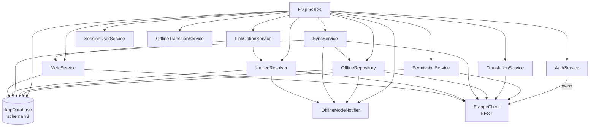
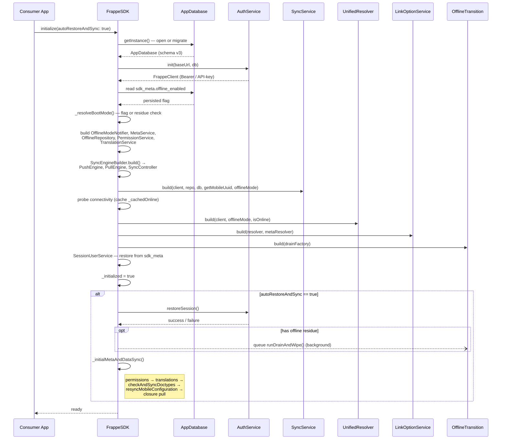
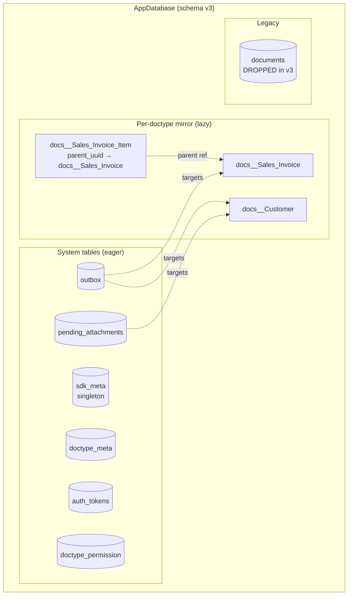
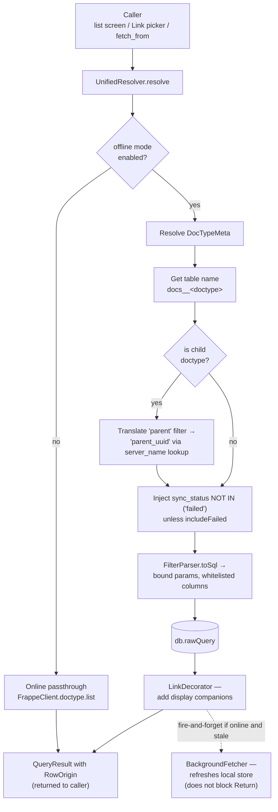
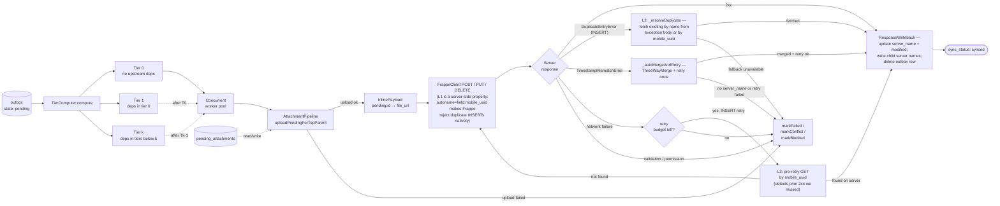
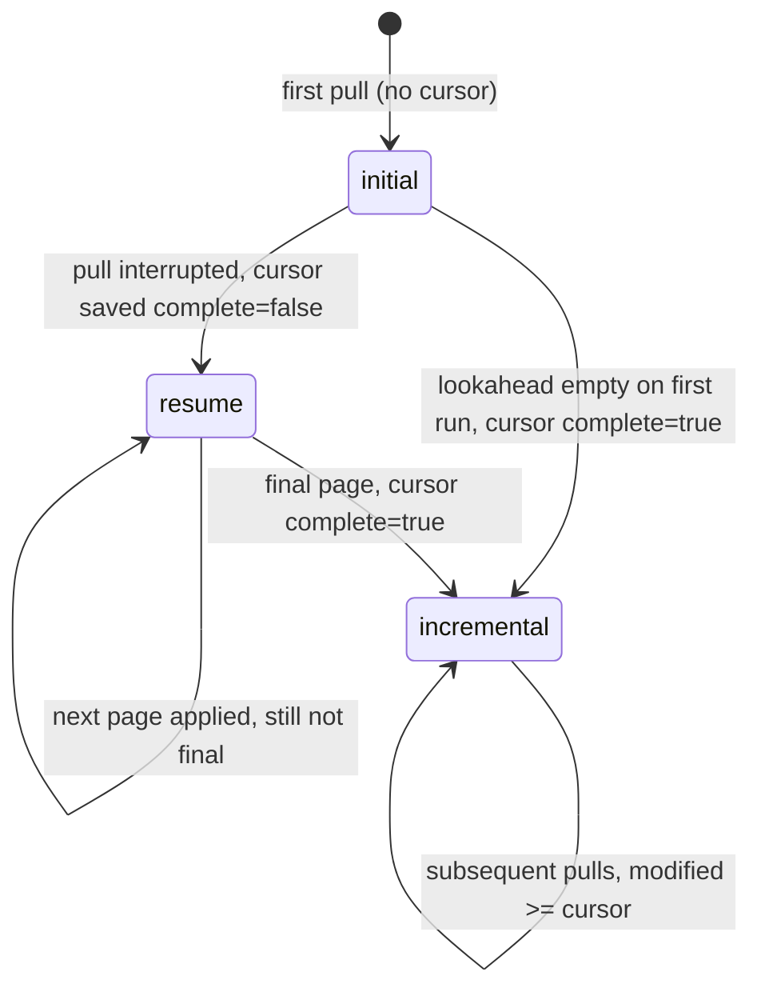
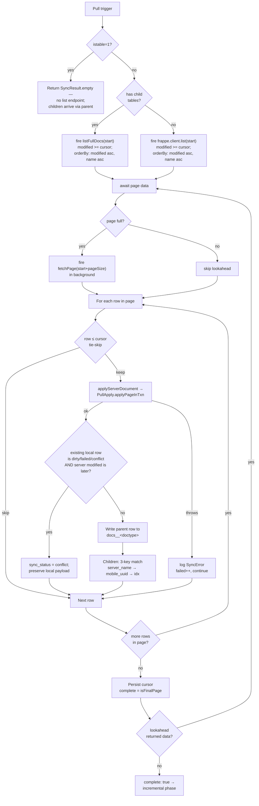
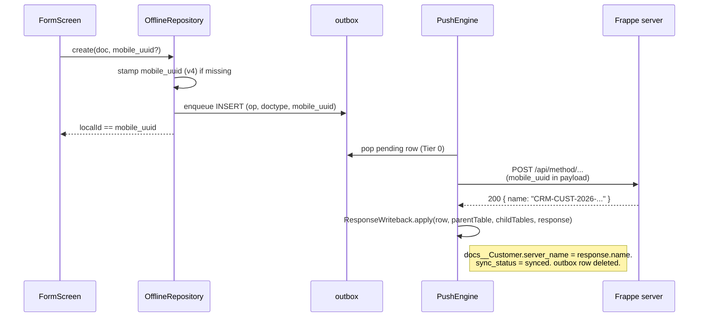
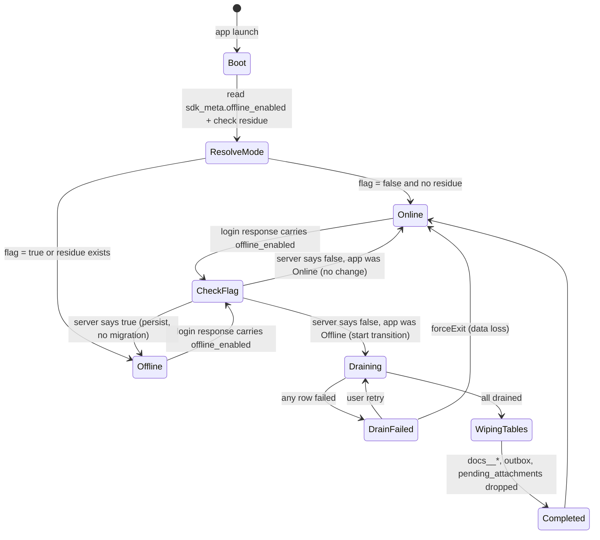
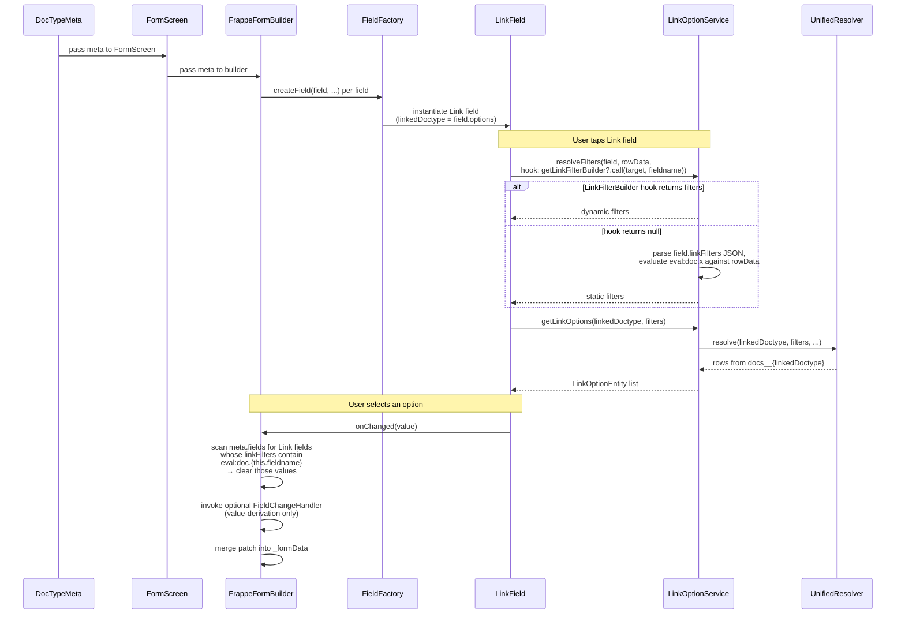

# Architecture — `frappe_mobile_sdk` 2.0

This document is the visual map of how 2.0 fits together. Every claim is grounded in code. Cites use `file::symbolName` form (durable across refactors); line numbers appear only when pointing into the middle of a method body.

Diagrams use [Mermaid](https://mermaid.js.org/) — GitHub, GitLab, and pub.dev render them inline.

---

## 1. Service dependency graph

`FrappeSDK` is the top-level façade. On `initialize()` it builds the service graph in dependency order, wires the read and write paths, and exposes the resulting components as fields.

- `FrappeSDK` is defined at `lib/src/sdk/frappe_sdk.dart::FrappeSDK`.
- All services accept an `OfflineModeNotifier` and short-circuit to REST passthroughs when `offline_enabled = false`. See [Offline-mode lifecycle](#8-offline-mode-lifecycle).
- The sync sub-engines — `PushEngine` (`lib/src/sync/push_engine.dart`), `PullEngine` (`lib/src/sync/pull_engine.dart`), `SyncController` (`lib/src/services/sync_controller.dart`) — are built by `SyncEngineBuilder.build()` and owned directly by `FrappeSDK` as private fields. `SyncService` calls them via function injection (`pushRunner`, `pullRunner`). Omitted from the graph to reduce visual noise; their internal flows are in sections 5 and 6.

---

## 2. Init flow

`FrappeSDK.initialize([autoRestoreAndSync])` is the production entrypoint. A one-shot lock prevents concurrent initialization.

- Public entry: `lib/src/sdk/frappe_sdk.dart::initialize` (one-shot lock around `_doInitialize`).
- The internal builder: `lib/src/sdk/frappe_sdk.dart::_doInitialize`.
- Post-restore bootstrap: `lib/src/sdk/frappe_sdk.dart::_initialMetaAndDataSync` runs permissions → translations → `MetaService.checkAndSyncDoctypes` → `MetaService.resyncMobileConfiguration` → closure pull. Each step logs its own failures and does not rethrow. Closure pull only runs in offline mode (gated by `_offlineMode.enabled`).

For testing, `lib/src/sdk/frappe_sdk.dart::FrappeSDK.forTesting` wires the same graph synchronously without `FlutterSecureStorage` and without async connectivity probes.

---

## 3. Storage layers

The single SQLite file holds three logical layers. Two of them are touched on every write; the third holds engine state.

| Layer | Tables | Created where | Purpose |
|---|---|---|---|
| Per-doctype mirror | `docs__<doctype>` (parent or child schema) | Lazily — first pull for that doctype, via `lib/src/services/offline_repository.dart::OfflineRepository.ensureSchemaForClosure`. | Native columnar offline store. Read path (`UnifiedResolver`) queries this. Children carry `parent_uuid`. |
| System | `sdk_meta`, `outbox`, `pending_attachments`, `doctype_meta`, `auth_tokens`, `doctype_permission` | Eagerly — `lib/src/database/app_database.dart::_onCreate` on fresh install; `lib/src/database/app_database.dart::_migrateV2ToV3` on upgrade. | Engine state: schema version, push queue, attachment queue, meta cache, tokens, permissions. |
| Legacy | `documents` | Dropped inside `_migrateV2ToV3` (`DROP TABLE IF EXISTS documents`). | Removed in 2.0 — see [Schema migration](schema-migration.md). |

Schema invariants:

- `mobile_uuid` is the PRIMARY KEY on every parent `docs__*` table.
- `server_name` is `UNIQUE WHERE server_name IS NOT NULL`, enforcing single-identity for synced rows.
- A row's identity transitions from `(mobile_uuid)` to `(mobile_uuid, server_name)` on first successful push.

---

## 4. Read path — `UnifiedResolver`

All list reads (list screens, Link pickers, `fetch_from`) flow through one resolver.

- Resolver entrypoint: `lib/src/query/unified_resolver.dart::UnifiedResolver.resolve`.
- Filter parsing: `lib/src/query/filter_parser.dart::FilterParser` — pure function, no DB or I/O.
- Background refresh: `lib/src/query/unified_resolver.dart::BackgroundFetcher` typedef; the fire-and-forget call is wired by `FrappeSDK._doInitialize` to delegate to `SyncService.pullSyncWaiting`.
- Behavior change: `pullSync` skips child doctypes (`istable=1`) via `lib/src/services/sync_service.dart::_isChildTable` invoked at the top of `_pullOneInternal` — children come embedded in parent pulls.

For details on Link decoration and `fetch_from`, see [`doc/OFFLINE_FIRST.md`](../OFFLINE_FIRST.md#read-path-unifiedresolver).

---

## 5. Push pipeline — tier-ordered outbox dispatch

The push engine drains the outbox in dependency-aware tiers.

- Push entry: `lib/src/sync/push_engine.dart::PushEngine.runOnce`.
- Attachment upload: `lib/src/sync/attachment_pipeline.dart::AttachmentPipeline.uploadPendingForTopParent` — runs before payload assembly; resolves `pending:<id>` markers via `inlinePayload`; exhausted retries throw `BlockedByUpstream` → `markBlocked`.
- Tiering: `lib/src/sync/tier_computer.dart::TierComputer.compute`. Tier 0 has no inter-pending dependencies; tier `k` depends only on tiers `< k`. Stable order within a tier: `createdAt asc, id asc`.
- Idempotency on INSERT lives in `lib/src/sync/push_engine.dart::PushEngine._dispatchOnce`. L1 is a server-side property (`autoname=field:mobile_uuid` makes Frappe reject duplicates by `name == mobile_uuid`); only L2 and L3 are SDK code paths — L2 is `PushEngine._resolveDuplicate` against the `DuplicateEntryError` body; L3 is the pre-retry GET-by-`mobile_uuid` inside `_dispatchOnce`.
- Reconcile (2xx success): `lib/src/sync/response_writeback.dart::ResponseWriteback.apply` (or `applyInTxn` inside a `WriteQueue` transaction). Updates `server_name`, `modified`, `sync_status` on the parent row; writes child server names; deletes the outbox row — all in one transaction.
- TimestampMismatchError path: `lib/src/sync/push_engine.dart::PushEngine._autoMergeAndRetry` — fetches the fresh server snapshot, calls `ThreeWayMerge.mergeFields` against the stored `push_base_payload`, persists merged values, retries `_dispatchOnce` once. Exhausted or no `server_name` → `markConflict`.

---

## 6. Pull pipeline — cursor-based delta

Each doctype maintains a `(modified, name)` watermark cursor with a phase tag.

For each page:

Key cites in this pipeline:

- Pull entry: `lib/src/services/sync_service.dart::SyncService._pullOneInternal`.
- API selection: `listFullDocs` is used when the doctype has any `Table` / `Table MultiSelect` fields (children must arrive embedded); `frappe.client.list` is used for flat doctypes. Resolved once at the start of each `_pullOneInternal` call via `_repository.doctypesWithChildren()` + `_doctypeHasChildTables()`.
- Server-side filter (`modified >= cursorModified`) is built inside `_pullOneInternal`'s `filters` construction.
- Client-side tie-skip is row-level inside the page loop (handles same-second collisions where the cursor's tie group spans pages): the check compares `(row.modified, row.name)` against `(cursorModified, cursorName)` and skips strictly-≤ rows.
- Child guard: `lib/src/services/sync_service.dart::SyncService._isChildTable`, invoked at the top of `_pullOneInternal`.
- Final-page detection: `isFinalPage = lookahead == null` — lookahead is fired only when the current page came back full (`page.length >= pageSize`).
- Conflict detection: `lib/src/sync/pull_apply.dart::PullApply.applyPageInTxn` — fires `sync_status = 'conflict'` only when the existing row is in `dirty / failed / conflict / blocked` AND incoming `modified` strictly post-dates stored `modified`.
- Per-row error handling: `applyServerDocument` is called inside a `try/catch`. On unexpected failure (DB error, parse error), the row is logged as a `SyncError`, `failed` is incremented, and the loop continues to the next row without updating the cursor for that row.

For deeper detail (closure pull, attachments), see [`doc/OFFLINE_FIRST.md → Pull Lifecycle`](../OFFLINE_FIRST.md#pull-lifecycle).

---

## 7. Mobile UUID round-trip

When a locally-created doc is pushed for the first time, identity must transition from `(mobile_uuid)` to `(mobile_uuid, server_name)` without breaking inbound Link references.

- Push reconcile: `lib/src/sync/response_writeback.dart::ResponseWriteback.apply` / `applyInTxn` (via WriteQueue). Updates `server_name`, `modified`, `sync_status = synced`; writes child server names; deletes the outbox row in a single transaction.
- `lib/src/services/offline_repository.dart::reconcileServerSave` is a **separate path** used by `FormScreen` for server-first (online) saves — it calls `LocalWriter.markSynced` + `OutboxDao.cancelPendingFor` + `applyServerDocument`. It is not called by `PushEngine`.

**Link references that already pointed at the row** (via local `mobile_uuid`) are rewritten to `server_name` on **their** push, by `lib/src/sync/uuid_rewriter.dart::UuidRewriter.rewrite`. Each Link column has an `<field>__is_local` companion flag (`= 1` until reconciled).

---

## 8. Offline-mode lifecycle

The session-bound offline mode is resolved at boot and can flip mid-session via the server flag.

- Boot resolution: `lib/src/sdk/frappe_sdk.dart::_resolveBootMode`.
- Transition states: `lib/src/services/offline_transition_service.dart::OfflineTransitionState` (sealed hierarchy: `TransitionIdle`, `TransitionDraining`, `TransitionDrainFailed`, `TransitionWipingTables`, `TransitionCompleted`).
- Drain + wipe: `lib/src/services/offline_transition_service.dart::OfflineTransitionService.runDrainAndWipe`.
- UI surface: wrap your app with `lib/src/ui/offline_transition_guard.dart::OfflineTransitionGuard`; it overlays `OfflineTransitionScreen` while transition is non-idle.

For server-side configuration of `offline_enabled`, see [`doc/OFFLINE_MODE_TOGGLE.md`](../OFFLINE_MODE_TOGGLE.md).

---

## 9. Form pipeline — render → change → cascade → link picker

When the user edits a Link field with dependent siblings, multiple subsystems coordinate.

- Form construction: `lib/src/ui/widgets/form_builder.dart::FrappeFormBuilder`.
- Field dispatch: `lib/src/ui/widgets/fields/field_factory.dart::FieldFactory.createField`.
- Cascade clears (form-level): inside `_FrappeFormBuilderState`'s per-field `onChanged` — when `oldValue != value`, it walks `widget.meta.fields` and removes any `Link` field whose `linkFilters` regex matches `eval\s*:\s*doc.{thisFieldname}`.
- `LinkFilterBuilder` callsite: inside `lib/src/ui/widgets/fields/link_field.dart::_LinkFieldState`, the hook is invoked as `widget.getLinkFilterBuilder?.call(targetDoctype, fieldname)`. **Keyed on the target doctype** (`field.options`), not the owning field's name.
- Filter resolution helper: `lib/src/services/link_option_service.dart::LinkOptionService.parseLinkFilters`.

For `LinkFilterBuilder` patterns and examples, see [`doc/LINK_FILTER_BUILDER.md`](../LINK_FILTER_BUILDER.md).

---

## See also

- [whats-new.md](whats-new.md) — feature inventory with code samples.
- [breaking-changes.md](breaking-changes.md) — what to fix in your app.
- [schema-migration.md](schema-migration.md) — v2→v3 step-by-step with diagrams.
