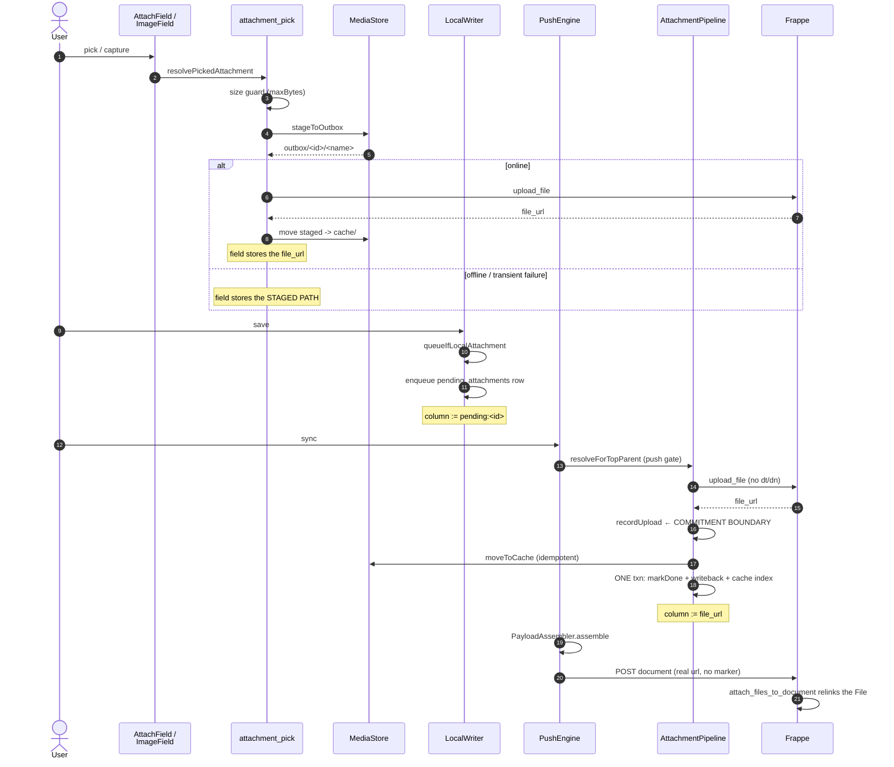
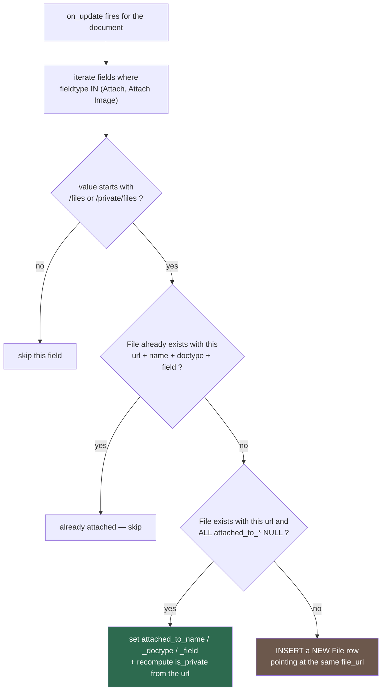
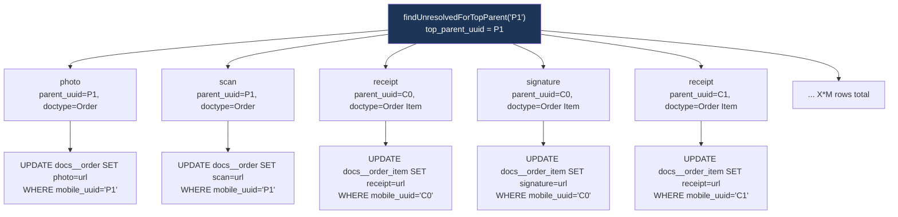
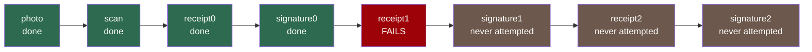
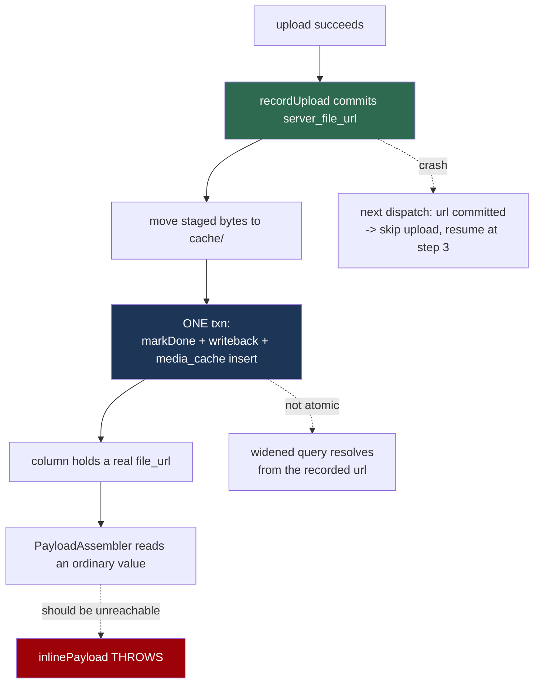
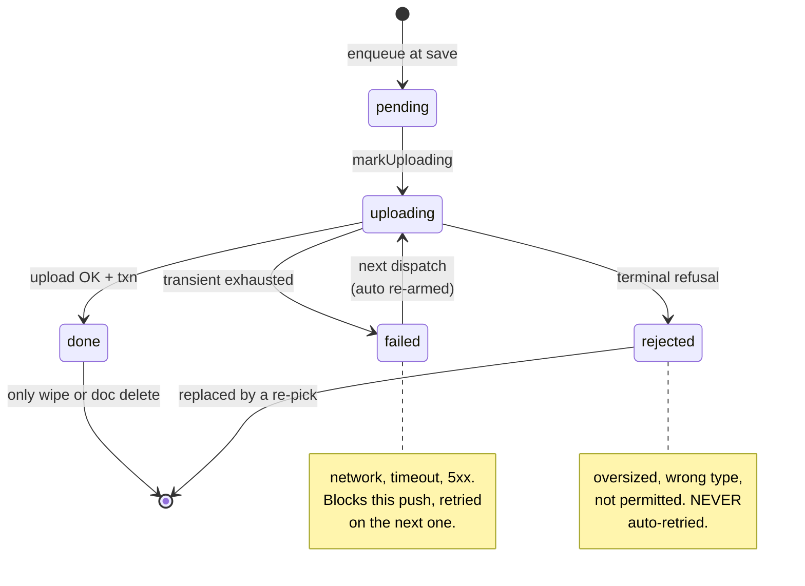
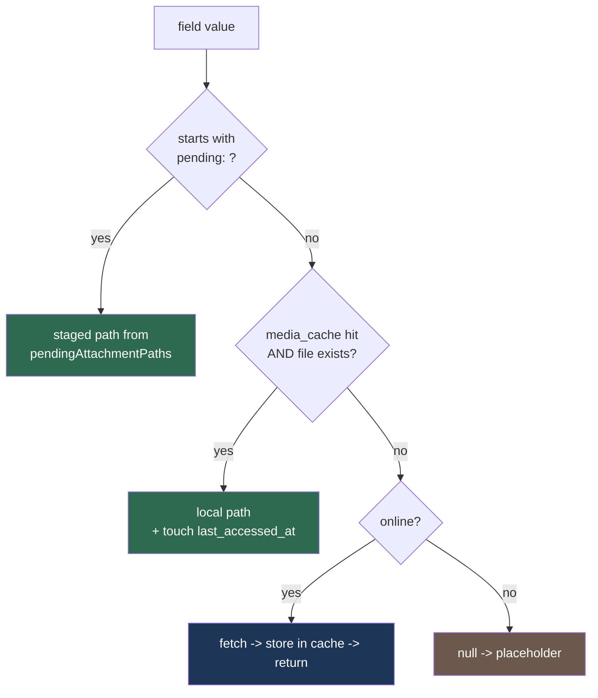
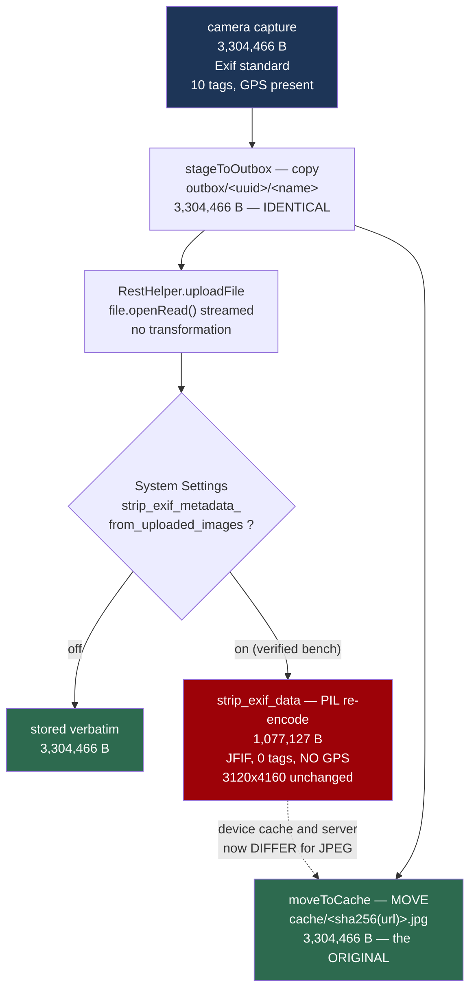

# Attachments — `frappe_mobile_sdk` 2.0

How an attachment travels from a camera tap to a Frappe `File` record and back onto the screen, including offline.

Every claim is grounded in code. Cites use `file::symbolName` form; line numbers appear only when pointing into the middle of a method body. Diagrams use [Mermaid](https://mermaid.js.org/) — GitHub, GitLab and pub.dev render them inline.

---

## 1. The problem this design solves

An attachment is the only part of a Frappe document whose bytes cannot travel inside the document. The field holds a *reference* (`/files/photo.jpg`), and that reference does not exist until a separate upload has happened. Offline, that upload cannot happen at save time — so the field has to hold something else in the meantime.

2.0 holds a **marker**: `pending:<id>`, pointing at a row in `pending_attachments`. The pipeline's whole job is to make sure a marker is *never* the thing that reaches the server.

That is harder than it looks, because the payload is rebuilt from the local mirror on **every** dispatch (`payload_assembler::PayloadAssembler.assemble`), not cached from the first attempt. So marker resolution must be correct on attempt 1, attempt 2, and after a crash — not just on the happy path.

---

## 1a. Which flows this touches — it is **not** push-only

A reasonable first assumption is that this is a sync/push feature. It is not. The work spans six flows, and only one of them is the push pipeline:

| Flow | What changes here | Push pipeline involved? |
|---|---|---|
| **Pick** | size guard before staging, terminal/transient split, staging layout, inline upload only when offline mode is OFF | No |
| **Save** | enqueue + marker write, size / MIME / original-name capture, re-pick file reclaim | No |
| **Push** | upload, the commitment boundary, writeback, the gate, payload inlining, `rejected` | **Yes — this is it** |
| **Read / preview** | `MediaResolver`, `media_cache`, lazy download, rendering from disk | No |
| **Delete / discard** | staged-file reclaim on all three document-removal paths | No |
| **Logout / wipe** | `MediaStore.clearAll` | No |
| **Schema** | v6 → v7 `media_cache` | Cross-cutting |

### The corollary worth internalising

**With offline mode OFF, the push pipeline's attachment half is inert.** An online pick uploads immediately and stores a real `file_url`; `isLocalAttachmentPath` excludes `/files/` and `/private/files/`, so `queueIfLocalAttachment` never fires, no `pending_attachments` row is created, and the gate passes trivially with nothing to resolve.

That means the corruption this release fixes (§4) could **only ever** affect an attachment picked while offline mode was on, or one whose inline upload failed transiently. It was never reachable on an online-only device — which is also why it survived so long.

**With offline mode ON, connectivity no longer decides.** A pick is always staged and queued, even on a fully connected device (`isOfflineMode` → `resolvePickedAttachment(offlineModeEnabled: true)`). Two reasons:

1. Offline-first promises data entry never blocks on the network. An inline upload makes the enumerator wait for a round trip before the field populates.
2. An inline upload puts the attachment **outside** the offline pipeline entirely — no `pending_attachments` row, so no push gate, no `rejected` state, no cache entry, and nothing recording that the upload happened. A draft discarded afterwards would leave an orphaned `File` on the server that the SDK cannot even name.

So under offline mode the document and its attachments travel together, which is the property the gate depends on.

The read path is the mirror image: it is entirely independent of push and runs for **every** document, including ones pulled from the server that this device never created.

---

## 2. The commitment model

Two rules carry the whole design:

> **1. A `server_file_url` committed to SQLite is the correctness boundary.**
> Not the HTTP response — the *committed row*. A url that has been received but not yet written to disk is not a fact the pipeline may rely on.

> **2. Upload and document-push are independent commitments.**
> Once the url is committed, the file is uploaded — permanently — regardless of whether the parent document ever syncs. No later attempt re-uploads it.

Rule 2 is what makes retries safe. Rule 1 is what makes rule 2 implementable: there is a real window between the server committing the file and this device knowing about it, and pretending otherwise is how duplicate uploads happen.

The gap between the two is handled by the server, not the client: Frappe's `save_file` computes `content_hash = md5(content)` and reuses an existing `File` with the same `(content_hash, is_private)` rather than storing a second copy. A retry after a lost response therefore returns the **same** `file_url`. This is why the SDK does **no** client-side hashing or pre-flight lookup — verified against Frappe 16.25.0, 16.26.3 and 17.0.0-dev.

---

## 3. Full lifecycle



Steps 1–9 happen at pick time; 10–12 at save; 13–20 at sync. The two upload triggers (pick-time when online, push-time otherwise) are deliberate: immediate upload gives the user a fast error, which for an oversized photo is the difference between retaking it and losing it.

---

## 3a. How the uploaded file is rewired to the real record and field

This is the part with the most moving pieces, because **the upload happens before the document exists**. Three things have to converge: the bytes (a `File` record), the reference (a docfield value), and the ownership link (`File.attached_to_*`).

### Step 1 — the file is uploaded deliberately unattached

`attachment_pipeline::AttachmentPipeline._resolveOne` calls the uploader with **no** `doctype` and **no** `docname`, so the resulting `File` row has all three of `attached_to_doctype`, `attached_to_name` and `attached_to_field` set to `NULL`.

That is not laziness. Two constraints force it:

1. At upload time the parent document does not exist on the server yet — an offline-created record has no `name` until its INSERT lands.
2. Frappe v16's `File` controller rejects `attached_to_doctype` without a non-empty `attached_to_name`, so the SDK cannot even send half the coordinate.

What the server holds at this point is a valid, orphaned `File` whose only identity is its `file_url`.

### Step 2 — the reference reaches the docfield

The pipeline writes the resolved `file_url` back into `docs__<doctype>.<fieldname>` (§4), `PayloadAssembler` picks it up as an ordinary column value, and the document POST carries it like any other string. The server stores it in the docfield exactly as Desk would.

So after the document saves, the server has a docfield holding `/files/photo.jpg` **and** an unattached `File` row whose `file_url` is `/files/photo.jpg`. They are not yet connected.

### Step 3 — Frappe joins them on `on_update`

`frappe/core/doctype/file/utils.py::attach_files_to_document` is registered on `doc_events["*"]["on_update"]` and `["on_update_after_submit"]`, so it runs for **every** doctype. Its logic, in order:



The match key in step E is the `file_url` **plus** all three `attached_to_*` being NULL. That is precisely the shape the SDK uploads, which is why the unattached upload is the right move rather than a workaround.

Note the two consequences of that final `else`:

- **`is_private` is recomputed from the url prefix during relink**, overriding what the SDK sent. A file uploaded privately that ends up at a `/files/...` url becomes public, and vice versa. The url wins.
- **If no unattached row is left**, stock **inserts a new `File`** pointing at the same `file_url`. So a parent attach field always ends up with a record, even when the url was already claimed. (The child-row hook behaves differently — see step 4.)

One upload always produces one `File` row, even when the bytes are deduped: `save_file` reuses the existing `file_url` and skips writing the blob, but still inserts the record. N uploads of identical bytes therefore give N `File` rows sharing one url and one file on disk — which is exactly what makes the per-row claiming in step 4 work.

### Step 4 — child table rows need a second hook

Stock `attach_files_to_document` reads `doc.meta.get("fields", ...)` — the fields of **the document being saved**. A child table row is a different doctype, and in v16 children persist through raw `db_update()` **without firing lifecycle hooks**. So a child row's `Attach` field is never visited by the stock hook: the file uploads fine, the docfield holds the right url, and the `File` stays orphaned forever.

`mobile_control/attachment_relink.py::relink_mobile_files` closes that. Verified against the installed app:

- Registered on `doc_events["*"]["on_update"]` **and** `["on_update_after_submit"]`, so it is a catch-all like stock's.
- **Fast-exits unless the doc has a `mobile_uuid`**, so non-mobile saves site-wide pay one attribute lookup.
- Walks `doc.meta.get_table_fields()` → each child row → each `Attach` / `Attach Image` field on that child.
- Skips a field already linked to `(url, child.doctype, child.name, fieldname)`, which makes re-saves idempotent.
- Claims **one** unattached `File` per field, `ORDER BY creation ASC LIMIT 1`, matching `attached_to_*` as NULL **or empty string** (stock matches only `None`).
- Writes via `frappe.db.set_value` — a raw UPDATE, so it does not recurse into its own `on_update` registration.

Two behavioural differences from stock worth knowing, both verified in source:

| | Stock (parent fields) | `mobile_control` (child rows) |
|---|---|---|
| No unattached `File` left | **Inserts a new one** | **Skips** — the row stays unlinked |
| `is_private` | **Recomputed** from the url prefix | Left untouched |

The "skip" is why a missing or failed child upload leaves a silent gap rather than a bogus record — but it also means a child row can end up with a correct docfield and no `File` link.

### How N parent fields and X child rows x M fields are identified

Identification happens **twice**, at two different stages, with two different keys. Conflating them is easy and wrong.

#### Stage 1 — the push pipeline, on device: the uuid triple + fieldname

This is where each attachment is matched to its exact slot, and it is done **entirely** with the identifiers the device already holds. `file_url` is the *value being written*, never the key.

| Column | Selects | In code |
|---|---|---|
| `top_parent_uuid` | the **set** of attachments belonging to one outbox row | `findUnresolvedForTopParent` → `where: 'top_parent_uuid = ? AND state != ?'` |
| `parent_doctype` | **which table** — `docs__order` vs `docs__order_item` | `_tableFor(p.parentDoctype)` |
| `parent_uuid` | **which row** in that table | `where: 'mobile_uuid = ?', whereArgs: [p.parentUuid]` |
| `parent_fieldname` | **which column** on that row | `<String, Object?>{p.parentFieldname: resolvedUrl}` |

So for N parent fields and X child rows carrying M each:



`top_parent_uuid` is the only thing that makes this **one** operation: it is stamped with the parent's `mobile_uuid` for every attachment at any depth, so a single query gathers the whole set and the push gate can block on all of it together. The other three then disambiguate completely — `(parent_uuid, parent_fieldname)` is unique per queued attachment, which is also the key the re-pick replacement uses.

Note `parent_uuid` is matched against `mobile_uuid` in the target table, **not** against `parent` or a server name. That is what lets the writeback work before the document has ever been to the server: a child row created offline has a `mobile_uuid` and no server identity at all.

Marker resolution in `inlinePayload` is likewise by **row id** (`pending:<id>`), not by url.

#### Stage 2 — the server's relink hook, post-save: `file_url`

None of the four columns above cross the wire — they are device-local identity. So after the document saves, the relink hooks have no way to ask "which field did this file belong to". They re-derive it by **walking the saved document** and reading what each attach field actually holds, matching that value against `File.file_url` where `attached_to_*` is still unset.

That is why the two stages use different keys, and why the SDK's job ends at putting the right url in the right column: once it has done that, the url *is* sufficient for the server to reconstruct the coordinate it needs.

Three properties follow on the server side:

1. **Child identity never has to survive the round trip.** Frappe assigns child `name`s at insert; the device's `C0`/`C1` uuids are irrelevant to relinking. The hook reads each child row *after* it is saved, so it uses the real server name.
2. **Order and reordering do not matter.** Matching is by value, so a child table Frappe renumbers or reorders still relinks correctly.
3. **Shared bytes still resolve one-to-one.** Each upload produces its own `File` row even when the blob is deduped, and a claimed row stops matching the `IS NULL` filter — so the next field gets the next row.

The failure mode to watch on the server side is arithmetic: the hook claims **one `File` per attach field it walks**. Fewer unattached rows than referencing fields leaves the surplus unlinked — which is what the push gate prevents by refusing to push until every attachment is `done`.

### What the SDK guarantees, and what it does not

| Guarantee | Owner |
|---|---|
| The docfield holds a real `file_url`, never a marker | **SDK** — verified by tests |
| The bytes exist on the server before the document POST | **SDK** — the commitment boundary |
| Identical bytes are stored once | **Frappe** — content-hash dedup |
| A parent `Attach` / `Attach Image` field gets its `File` linked | **Frappe** — stock `on_update` hook |
| A child-row attach field gets its `File` linked | **`mobile_control`** — `relink_mobile_files`, one `File` claimed per field |

Two things follow that are worth stating plainly:

- **If `relink_mobile_files` is absent from the target server**, child-row attachments still upload and the docfield still holds the correct url — the file is reachable and renders — but `File.attached_to_*` stays NULL, so Desk's attachment sidebar will not show it and any server-side logic keying on `attached_to_name` will miss it. The SDK cannot detect this.
- **Stock relink covers `Attach` and `Attach Image` only.** Frappe's `Image` fieldtype is conventionally a *display* field that renders whatever the field named in its `options` holds, so it normally carries no url of its own; the SDK nonetheless treats `Image` as an attachment field (`local_writer::kAttachmentFieldTypes`). If you store a url directly in an `Image` field, expect no stock relink for it.

---

## 3b. Many fields: N on the parent, X child rows with M each

A realistic survey form is not one photo. Take **N** attach fields on the parent and **X** child rows carrying **M** each — total **N + (X x M)** attachments for one document. Behaviour is pinned by `test/sync/attachment_multi_field_test.dart` (N=2, M=2, X=3, so 8 attachments).

### One document, one query, one gate

Every row — parent field or child-row field — is stamped with the **top parent's** `mobile_uuid`, while `parent_uuid` stays the row's own. So the identity split is:

| | `parent_uuid` | `parent_doctype` | `top_parent_uuid` |
|---|---|---|---|
| Parent field | `P1` | `Order` | `P1` |
| Child row C0 field | `C0` | `Order Item` | `P1` |
| Child row C2 field | `C2` | `Order Item` | `P1` |

`findUnresolvedForTopParent('P1')` therefore returns all 8 in one query at any nesting depth, and the push gate blocks on the whole set together. `parent_uuid` + `parent_fieldname` is the precise coordinate the writeback uses, so each resolved url lands in its **own** row's column — a child's `receipt` updates `docs__order_item` `WHERE mobile_uuid = 'C0'`, not the parent's table.

The uniqueness key for a queued attachment is `(parent_uuid, parent_fieldname)`. N parent fields produce N rows sharing `parent_uuid = P1` with distinct fieldnames; each child row produces M rows under its own uuid. A re-pick replaces exactly one of them.

### Uploads are serial, and the first failure stops the pass

`resolveForTopParent` is a plain `for` loop with an `await` inside — **not** a `Future.wait`. So:



`_resolveOne` throws, which aborts the loop. Three consequences, all deliberate:

1. **Progress is never thrown away.** Each attachment commits in its own transaction, so `photo`, `scan`, `receipt0` and `signature0` are already `done` with their columns written back. The document is blocked, not reset.
2. **The rest stay `pending`,** untouched — they were never attempted, so they carry no retry count or error.
3. **The next dispatch finishes the set** and re-uploads nothing that already landed: `done` rows are outside `findUnresolvedForTopParent`, and a row holding a committed `server_file_url` skips the upload entirely.

That is why total upload count across a recovered document is *(attempts on the failing item)* + *(one per attachment that had not yet succeeded)* — never one per attachment per dispatch.

### Cost, and where it bites

- **N + (X x M) sequential round trips.** 20 photos are 20 uploads, one after another. There is no parallelism and no batching; a slow link multiplies.
- **A transient failure costs its full backoff before the loop aborts** — with the default `[2s, 5s, 10s]` that is 2s + 5s of waiting across 3 attempts, and the attachments behind it wait for all of it before being deferred to the next dispatch.
- **One rejected attachment out of fifty blocks the document indefinitely.** That is the gate working as designed — the document cannot be represented faithfully without that file — but the error must identify *which* one, which is why `BlockedByUpstream` carries the file and field rather than a row id.

### Identical bytes in several fields

If the same photo is attached to M fields, each gets its own `pending_attachments` row and its own upload call — the SDK does not deduplicate client-side. Frappe's content-hash dedup then returns the **same** `file_url` for all of them, so:

- one set of bytes on the server,
- one `media_cache` entry on the device (keyed by url; the second `moveToCache` finds the destination present, reports success, and discards its now-redundant staged copy),
- and **one `File` record per field** — one per upload — which is precisely what lets each field claim its own during relink (§3a, step 4).

So the wasted work is upload bandwidth, not storage on either side.

---

## 4. Resolution mechanism

Three layers, each covering what the one before it cannot.



**1. Writeback (primary).** After `markDone`, the resolved `file_url` replaces the marker in `docs__<doctype>`. The marker ceases to exist the moment it is resolved, so payload assembly reads a normal value and the entire bug class disappears — including the auto-merge path, where `ThreeWayMerge` would otherwise carry the marker forward.

The three writes — `markDone`, the writeback, and the `media_cache` insert — are **one transaction**, so the column and the row can never disagree. It runs through the doctype's `WriteQueue` when the host wires one, matching the other two `docs__` writers in `push_engine` (`ResponseWriteback` and the auto-merge persist). Writing outside that queue would race them.

**2. Widened query (backstop).** `pending_attachment_dao::PendingAttachmentDao.findUnresolvedForTopParent` returns every row that is not `done`; `findAllForTopParent` feeds the resolution map, so a marker left by an interrupted writeback still resolves from the already-recorded url. Given the atomic transaction above this should be unreachable — a hit means the atomicity assumption broke.

**3. Hard failure (assertion).** `AttachmentPipeline.inlinePayload` **throws** on an unresolved marker. Previously it passed the marker through, which is exactly how the literal string `pending:42` was written into Frappe as an attach-field value, indistinguishable from a real one.

### The push gate

> **A document may only push when every one of its attachments is `done`.**

Anything else throws `BlockedByUpstream` carrying the file and field name — not a row id, which a user cannot act on. There is no path where a push proceeds with an unresolved attachment.

---

## 5. State machine



The `failed` / `rejected` split is load-bearing. Without it, re-arming failed rows would retry a permanently unuploadable file — an oversized photo, say — on every push forever. It mirrors the outbox's own `failed` / `paused` distinction.

**Replacing a rejected attachment creates a new operation.** A re-pick deletes the old row *and its staged file* and inserts a fresh `pending` one (`local_writer::queueIfLocalAttachment`), so it never inherits a stale retry count or error. A rejected row is never resurrected in place.

---

## 6. Storage layout

```
<appDocuments>/mform_attachments/
├── outbox/
│   └── <uuid>/<original filename>   ← staging. NEVER evictable.
└── cache/
    └── <sha256(file_url)><ext>      ← content store. Evictable, wiped on logout.
```

Two directories because staging and cache have **opposite** safety properties: an un-uploaded staged file is the only copy of those bytes in existence, while a cached download is always re-fetchable.

**Why staging uses a directory per pick.** The file keeps the name the user chose; uniqueness comes from the generated parent directory. The original filename has no other route to the server — it does not fit through the field's `onChanged`, and renaming to `<uuid><ext>` destroyed it at pick time, which is why every 2.0-beta upload landed server-side as an opaque uuid.

**Why the cache is keyed by `file_url`.** Frappe dedupes by content hash and returns the same url for identical bytes, so two documents can legitimately share one file. Keying per-document would store those bytes twice and turn deletion into a reference-counting problem. Keyed by url there is exactly one copy and the question never arises.

### The filesystem/SQLite boundary

There is **no transaction spanning the two**, and the design does not pretend otherwise. The step order makes every divergence self-healing:

| Divergence | Consequence |
|---|---|
| Cache file with no `media_cache` row | Invisible orphan bytes. Harmless. |
| `media_cache` row with no file | A cache **miss**. Re-fetches. |

Neither is an error, because cache content is non-authoritative by construction. And because `recordUpload` commits first, a crash anywhere after it resumes on the next dispatch instead of re-uploading.

---

## 7. Data model

### `pending_attachments` — the upload queue

Transient work items: `enqueue` → `uploading` → `done` / `failed` / `rejected`.

| Column | Notes |
|---|---|
| `parent_uuid`, `parent_doctype`, `parent_fieldname` | which field on which row |
| `top_parent_uuid` | the outbox row's `mobile_uuid`; child-row attachments carry the **parent's** uuid so one query finds them all |
| `local_path` | absolute staged path |
| `file_name` | the user's ORIGINAL filename |
| `mime_type`, `size_bytes` | derived at save time from the staged file |
| `server_file_url`, `server_file_name` | the commitment boundary |
| `state`, `retry_count`, `error_message` | see §5 |

### `media_cache` — the content store (new in this release)

| Column | Notes |
|---|---|
| `file_url` | **PRIMARY KEY** — one copy per url, however many docs reference it |
| `local_path` | `cache/<sha256(file_url)><ext>` |
| `size_bytes`, `mime_type`, `is_private` | |
| `source` | `uploaded` (this device made it) / `downloaded` (fetched for preview) |
| `created_at`, `last_accessed_at` | `last_accessed_at` is written now and consumed by Phase 2's LRU |

Schema **v6 → v7** (`app_database::_migrateV6ToV7`). Nothing is backfilled: an empty cache table simply means every lookup is a miss and re-fetches on demand.

**Document deletion never touches the cache.** Deleting a document clears its upload-queue rows and staged files; cached bytes are pure performance state governed by eviction and wipe only. That is what lets eviction be deferred without leaving a correctness hole.

---

## 8. Case matrix

Every case is resolved by the two rules in §2. All are covered by tests in `test/sync/attachment_pipeline_cases_test.dart`, which assert the uploader **call count** — "no duplicate uploads" is a claim about invocations, not just outcomes.

| # | What happens | Row state | Behaviour | Re-upload? |
|---|---|---|---|---|
| 1 | All succeeds | `done` + url | — | No |
| 2 | Upload OK, crash before the txn | `uploading` + url | url committed → skip upload, resume | No |
| 3 | Upload OK, **response lost** | `uploading`, no url | Re-uploads; Frappe dedup returns the **same** url | No duplicate bytes or logical attachment |
| 4 | Crash between commit and writeback | `uploading` + url | Next dispatch resumes the move + txn | No |
| 5 | Upload OK, **parent push fails** | `done` | Column holds the real url; retry does no attachment work | No |
| 6 | Upload terminally refused | `rejected` | Push gate blocks with a named reason | Nothing was uploaded |
| 6b | Upload fails transiently | `failed` | Auto-retried next dispatch | Nothing was uploaded |
| 7 | Document deleted / discarded | rows + staged files gone | Server keeps an orphaned unattached `File` | — |
| 8 | Re-pick before sync | prior row + file gone | Prior upload (if any) orphaned server-side | — |
| 9 | Same file on two fields | two rows | Frappe dedupes bytes; both relink | No duplicate bytes |

**Case 3 is the one no client-side guard can solve** — a lost response is indistinguishable from a failure. The server's content-hash dedup covers it.

**Cases 7 and 8 leave orphaned unattached `File` rows server-side.** Frappe has no GC for these (its `attach_files_to_document` hook *attaches*, it does not collect). This release deliberately ignores that and records it as a `mobile_control` concern: the SDK deleting server `File` records it can no longer prove ownership of is riskier than a few orphan rows.

---

## 9. Error classification

`attachment_error_classifier::isTerminalAttachmentError` decides `failed` vs `rejected`, grounded in what the upload path actually raises (`rest_helper::RestHelper._handleResponse`).

| Error | Class | Why |
|---|---|---|
| `ValidationException` (417) | **terminal** | how `MaxFileSizeReachedError` arrives |
| `AuthException` 403 | **terminal** | this user may not upload here |
| `AuthException` 401 | transient | credential expired; refresh fixes it |
| 4xx other than 408/429 | **terminal** | client error, will repeat identically |
| 408, 429, 5xx | transient | may clear |
| `NetworkException` | transient | transport |
| anything unrecognised | transient | see below |

**Unrecognised errors default to transient.** A wrongly-transient error costs one retry; a wrongly-terminal one strands the user's file with no automatic recovery. Fail toward retrying.

### Failures that are deliberately not errors

- **Cache move fails** → the upload still succeeded (rule 1). The staged copy is reclaimed, since the bytes are on the server and nothing else would revisit an `outbox/` file once its row is `done`.
- **Step-4 transaction fails** → logged, never rethrown. The url is committed, so reporting failure would contradict rule 2.
- **Cached file missing** → a miss, re-fetched.
- **Preview download fails** → placeholder. A media fetch must never break form rendering.
- **Wipe during an in-flight upload** → the row is gone, so the response is discarded. No locking.

---

## 10. Read path

One function serves every value form, both field widgets, and both phases (`media_resolver::MediaResolver.resolve`):



A `pending:` value is **never** fetched over HTTP, even when malformed — it is local identity, not a url, and falling through to the network would turn a row id into a request path.

Consequences:

- `ImageField` renders from disk via `Image.file` when a cached copy exists, instead of `Image.network`. That is what makes a pulled document's image visible offline.
- `AttachField` hands `OpenFilex` a cached path instead of re-downloading on every open — which also removes the stale-bytes hazard the old temp-download path carried.
- Anything viewed once while online stays viewable offline. Phase 2's background prefetch is then a pure optimisation, not the thing that makes offline preview work.

**Labels never come from the resolved path.** The cache names files `sha256(file_url)`, so a label routed through it would read as 64 hex characters instead of `report.pdf`. Labels derive from the stored value; only the *view target* is resolved.

**The widgets depend on a `ResolveMediaFn` function**, not on `MediaResolver` itself — hosts pass `resolver.resolve`. That keeps the UI layer off the DAO/filesystem stack, which also makes the widgets testable: widget tests run in a fake-async zone where real sqflite and `dart:io` futures never complete. (Passing `resolver.resolve` works because the argument type is inferred; a host that has to *write the type out* — overriding `FieldFactory.createField`, for instance — currently cannot. See §13.)

**The resolve future is memoised per value** (`media_resolve_builder::MediaResolveBuilder`). Starting it inside `build` creates a new future on every rebuild, and each completion triggers another — an infinite loop that re-reads the cache and can re-download indefinitely.

---

## 11. Security and lifetime

Cached media includes files uploaded with `is_private = 1` (the default).

`FrappeSDK.logout(clearDatabase: true)` now calls `MediaStore.clearAll()`. Before this release the store survived logout entirely: `AppDatabase.clearAllData()` drops `pending_attachments` and `media_cache`, but the **files live outside SQLite**, so on a shared device one user's private survey photos stayed readable after the next sign-in.

The wipe is **destructive by design** — it also clears `outbox/`, which holds the only copy of any attachment that never uploaded.

---

## 12. Host API

| Member | Purpose |
|---|---|
| `FrappeSDK.mediaStoreUsage()` | staged / cached / reclaimable bytes; `orphanBytes` is a subset of `outboxBytes` and excluded from `totalBytes` |
| `FrappeSDK.sweepOrphanedMedia()` | deletes staged files nothing references; returns bytes reclaimed; never throws |
| `FrappeSDK.clearMediaCache()` | clears `cache/` + `media_cache` ONLY — safe, cannot lose an un-uploaded attachment |
| `kDefaultMaxAttachmentBytes` | 10 MB, matching Frappe's stock `max_file_size`. **Not host-overridable yet** — see §13 |
| `AttachmentTooLargeException` | thrown at pick, carries `sizeBytes` and `limitBytes` |
| `attachmentTooLargeMessage(e)` | user-facing message naming the real limit |
| `ResolveMediaFn` | what the field widgets accept; pass `resolver.resolve`. **Not exported — see §13.** Passing works by inference; *naming* the type does not compile from the public entry point |
| `FormScreen.imagePickSource` | host hook choosing gallery / camera / both for image fields; global, read live, null means both |

### Discarding an attachment

Both fields show a remove control whenever there is a value and the field is
editable. A mandatory field can still be cleared — `requiredValidator` catches it
at save, which is the right place; blocking the clear would trap a user who wants
to replace via discard-then-pick.

What happens depends on the value's shape, and the three cases differ:

| Value | On discard |
|---|---|
| staged path (never saved) | staged file deleted, field cleared |
| `pending:<id>` (saved, queued) | field cleared; the **save** drops the row and its staged file |
| `/files/…` (synced) | field cleared only; the server `File` is left alone, as with delete and re-pick |

Two things make this safe that are not obvious from the UI:

**The field clears before the bytes are reclaimed.** A failure reclaiming leaves
an orphan the sweep collects; a failure *aborting the clear* would leave the
attachment in place while the user believes it is gone. The user's intent must
not depend on a filesystem call succeeding.

**Clearing a field drops its queued row.** `LocalWriter` deletes the
`pending_attachments` row when an attach field arrives empty. Without that the
row would survive with the column emptied, and the push gate would block the
document forever on an attachment nothing references.

**And the writeback is conditional on the marker still being present**
(`WHERE mobile_uuid = ? AND <field> = 'pending:<id>'`). An upload that was
already in flight when the user discarded would otherwise complete and rewrite
the url into the column they just emptied — the same class of defect as the
original marker bug: a write that assumes nothing changed underneath it.

### Choosing the pick source

`ImagePickSource` — `gallery`, `camera`, or `both` — supplied by a host hook that
is global across doctypes and fields and read live, so it can be flipped from a
setting without rebuilding. Null means `both`, so existing hosts are unaffected.
`camera` removes the gallery route entirely, which is the point when a fresh
capture is required and a stock image must not be submittable.

Applies to `Attach Image` / `Image` only: `Attach` uses the system file picker,
which has no gallery/camera distinction.

### Reclaim, and what can lose data

| | Deletes | Can lose data? |
|---|---|---|
| `sweepOrphanedMedia()` | only unreferenced `outbox/` files | **No** — by construction |
| `clearMediaCache()` | `cache/` + `media_cache` rows | **No** — always re-fetchable |
| `logout(clearDatabase: true)` | the whole store, `outbox/` included | **Yes** — intended: private media must not outlive the session |

A staged file is reclaimable only when **no `pending_attachments` row references
it** and **it was not staged in this session**. Both guards are exact; there is
no age heuristic, so a pick sitting in an open form is never at risk.

The size guard runs **before** the durable copy is made, so an oversized pick never occupies disk. A file that cannot be stat'd skips the guard rather than being refused — failing to measure is not evidence of being too large.

---

## 13. Limitations

- **Media growth is bounded only by explicit action.** There is still no automatic eviction of `cache/` (Phase 2). Orphaned *staged* files are reclaimable via `sweepOrphanedMedia()`, and `mediaStoreUsage()` reports how much that would free — but both are host-triggered. Nothing runs on a timer or at startup.
- **Cache orphans are still not reclaimed.** A file in `cache/` with no `media_cache` row — from a crash between writing the bytes and indexing them — is invisible to both the sweep (which walks `outbox/` only) and to eviction (which is driven by the index). Folded into Phase 2, whose eviction pass already walks that directory.
- **No client-side compression, and the server may rewrite the bytes anyway.** `pickImage` is called with no `imageQuality` / `maxWidth` / `maxHeight`, so a capture is full-resolution — measured at 3.3 MB and 4.1 MB on a mid-range Android device (§16). The SDK uploads that file **verbatim**: `rest_helper::RestHelper.uploadFile` streams `file.openRead()` with no transformation. What happens next is the *server's* choice, and two distinct mechanisms are easy to conflate:

  - **`optimize_image` does not run.** Frappe's `upload_file` gates it on a client-supplied `optimize` form field (`frappe/handler.py:144,168`) that the SDK does not send. It would also resize to ≤1024×768; measured server copies kept the full 3120×4160, which is independent confirmation it never fired.
  - **`strip_exif_data` does run when the site enables it.** `frappe/core/doctype/file/file.py:696-701` calls it when System Settings' `strip_exif_metadata_from_uploaded_images` is on — it is on the verified bench. The name undersells it: `strip_exif_data` rebuilds the image through PIL (`Image.open` → `Image.new` → `putdata` → `save`), so it **re-encodes at PIL's default JPEG quality** rather than merely deleting a metadata block.

  Three consequences, all measured (§16):

  | | Effect |
  |---|---|
  | **JPEG only** | The guard is `content_type == "image/jpeg"`, so PNG uploads pass through byte-identical. Both gallery-picked PNGs matched to the byte; both camera JPEGs did not. |
  | **GPS EXIF is destroyed** | Camera originals carried 10 EXIF tags including `GPSInfo`; server copies carry 0 and no GPS. If photo-embedded location is meant to corroborate a submission, **it does not survive the upload.** A form's separate geolocation field is unaffected. |
  | **Generation loss** | 3,304,466 → 1,077,127 B and 4,149,928 → 1,561,416 B, at unchanged pixel dimensions. Pixel RMS difference was 2.41/255 and 3.17/255 *on those two files* — visually negligible, but lossy and cumulative if a file were ever re-uploaded. |

  None of this is SDK behaviour and none of it is a Frappe default you can assume everywhere — it is one site setting. Turn `strip_exif_metadata_from_uploaded_images` off if originals must be preserved.

- **`ResolveMediaFn` is not exported, so a host cannot override `FieldFactory.createField`.** The typedef appears in the signature of `FieldFactory.createField` — which is public, exported bare from the barrel, and explicitly documented as overridable ("Override this method to customize field creation") — but the typedef itself is declared in `src/services/media_resolver.dart`, which the barrel does not export. Dart does not re-export a library's *imports*, only its own declarations and anything it `export`s, and `field_factory.dart` merely imports the typedef. Verified by probing the public entry point: `ImagePickSource` and `MediaStoreUsage` resolve, while `ResolveMediaFn` fails with `Undefined class 'ResolveMediaFn'`. Passing `resolver.resolve` as an argument is unaffected (the type is inferred); a host that must **name** the type in an override signature has no route but an `implementation_imports` violation. **This is the same defect class as the `ImagePickSource` / `MediaStoreUsage` gap fixed under `[Unreleased]`** — a type on the public surface that no host can name — and the fix is the same one line, exporting it alongside them. Unshipped as of 2.0.0-beta.2.
- **No background prefetch.** Media for a pulled document is cached on first view, not ahead of time.
- **An inline (offline-mode-OFF) pick does not populate the cache.** `resolvePickedAttachment` deletes the staged copy after a successful inline upload rather than moving it into `cache/`, so previewing that file later costs a download. Only the **push** path promotes bytes into the cache via `moveToCache`. Note this no longer affects offline mode, where every pick goes through the push path and therefore does get cached. Closing it for the inline path is a small change: the bytes, the url and the store are all already in hand there.
- **The size limit is not host-configurable.** `kDefaultMaxAttachmentBytes` (10 MB) is the default for `resolvePickedAttachment`'s `maxBytes`, but the only callers are this SDK's own `AttachField` / `ImageField` and neither exposes an override. A deployment whose System Settings `max_file_size` differs will either refuse files the server would have accepted, or accept files it will reject at upload (which the pipeline then handles correctly as a terminal rejection — the document blocks with a named reason rather than corrupting). Making it configurable means threading a parameter through `FormScreen` -> `FormBuilder` -> `FieldFactory`, the same path `mediaResolver` takes.
- **Child-row relinking depends on `mobile_control`.** See §3.
- **Orphaned server `File` rows** after a delete or re-pick are not collected. See §8.
- **Partially verified on a device — two gaps remain.** The pick → save → push → relink path, the download-preview branch, and the logout wipe are now verified end to end on hardware (§16). What is still covered by no test *and* unexercised on a device: **camera lost-capture recovery** (the OS reclaiming the picker's cache path, or the host process being killed mid-capture — the case the durable copy exists for) and the **`OpenFilex` handoff** of a cached file. Offline *preview* from `outbox/` via `pendingAttachmentPaths` is also unexercised — §16's read-path evidence covers the downloaded-cache branch only.

---

## 14. Where the code lives

| Concern | File |
|---|---|
| Pick, size guard, terminal/transient split | `lib/src/utils/attachment_pick.dart` |
| Two-directory store, idempotent move | `lib/src/utils/media_store.dart` |
| Marker helpers, fetch-url builder, MIME | `lib/src/utils/attachment_paths.dart` |
| Upload queue | `lib/src/database/daos/pending_attachment_dao.dart` |
| Content store index | `lib/src/database/daos/media_cache_dao.dart` |
| Push gate, writeback, inlining | `lib/src/sync/attachment_pipeline.dart` |
| Terminal/transient classifier | `lib/src/sync/attachment_error_classifier.dart` |
| Save-time enqueue + marker write | `lib/src/services/local_writer.dart` |
| Preview resolution + lazy cache | `lib/src/services/media_resolver.dart` |
| Memoised resolve for widgets | `lib/src/ui/widgets/fields/media_resolve_builder.dart` |
| Upload endpoint fields | `lib/src/api/attachment_service.dart` |

---

## 15. Test coverage

Where to look when changing any of this, and what each file is protecting.

| Test | Pins |
|---|---|
| `test/sync/marker_resolution_regression_test.dart` | The three marker-corruption paths (§8 cases 1–6b). Began as repros asserting the **bug**; the inverted assertions are the proof of the fix. |
| `test/sync/attachment_pipeline_cases_test.dart` | The case matrix, asserting uploader **call counts** — "no duplicate uploads" is a claim about invocations. |
| `test/sync/attachment_multi_field_test.dart` | N parent + X child rows x M fields: one-query fan-out, per-row writeback targets, serial-failure semantics, resume without re-upload (§3b). |
| `test/sync/attachment_error_classifier_test.dart` | terminal vs transient, per exception type and status (§9). |
| `test/sync/attachment_pipeline_test.dart` | Backoff, the H3 no-re-upload guard, `inlinePayload` including the **throw** on an unresolved marker. |
| `test/sync/attachment_pipeline_cleanup_test.dart` | Staged copy leaves `outbox/` on success — and is still reclaimed when the cache move fails. |
| `test/sync/attachment_pipeline_child_discovery_test.dart` | Child-row attachments are found via `top_parent_uuid`. |
| `test/sync/offline_attachment_e2e_test.dart` | Multi-marker resolution into the right slots. |
| `test/services/attachment_file_reclaim_test.dart` | `deleteForTopParent` removes files with rows, spares other documents, and **never touches the cache**. |
| `test/services/media_resolver_test.dart` | All four resolution branches, self-healing on a missing file, and that a `pending:` value is never fetched over HTTP. |
| `test/services/media_wipe_test.dart` | Logout clears staged **and** cached media; `storeSizeBytes` counts nested staged files. |
| `test/services/local_writer_attachments_test.dart` | Marker write, no double-enqueue on re-save, and that size / MIME / **original filename** are recorded. |
| `test/utils/media_store_test.dart` | Directory layout, deterministic cache paths, idempotent `moveToCache`, collision safety. |
| `test/utils/attachment_pick_test.dart` | Size guard before staging, and the terminal-vs-transient split at pick time. |
| `test/utils/attachment_paths_test.dart` | Marker parsing and local-path classification. |
| `test/utils/attachment_storage_test.dart` | The legacy `copyToAttachmentStore` entry point still lands in `outbox/`. |
| `test/database/media_cache_migration_test.dart` | v6 → v7, idempotently, with `file_url` as the primary key. |
| `test/database/daos/media_cache_dao_test.dart` | Upsert-not-duplicate, `touch`, `totalBytes` tolerating NULL sizes. |
| `test/database/daos/pending_attachment_dao_test.dart` | `findUnresolved` returns every non-done state — including `rejected`, which must still block. |
| `test/utils/media_store_sweep_test.dart` | Orphan rule end to end: row-backed and live-set files spared, `cache/` untouched, byte accounting, empty-store and vanishing-file safety. |
| `test/sdk/media_reclaim_api_test.dart` | A queued attachment is never swept; a **failed** referenced-set query deletes nothing. |
| `test/sdk/clear_media_cache_boundary_test.dart` | `clearMediaCache()` spares `outbox/` files and `pending_attachments` rows. |
| `test/ui/widgets/fields/image_pick_source_test.dart` | The source hook gates each button; discard clears value AND UI; a late-arriving host value still renders. |
| `test/ui/widgets/fields/attach_field_replace_test.dart` | Re-pick reclaims the replaced file; host paths, `pending:` markers and cache paths are never deleted. |
| `test/api/attachment_service_test.dart` | The `doctype` / `docname` / `file_name` keys, and that the multipart part carries the **original** filename. |

**What no test in this repo covers.** Still unautomated, and now split by whether a device run has since covered it:

| | Status |
|---|---|
| Platform file / image pickers | **Verified on device** (§16) — gallery and camera, both producing correct staged files |
| Real `path_provider` paths | **Verified on device** (§16) |
| The Frappe-side relink contract in §3a | **Verified on a running site** (§16) — was previously source-only, against three Frappe checkouts |
| `mform_attachments/` actually gone after logout | **Verified on device** (§16) — the directory itself is removed, not merely emptied |
| `OpenFilex` handoff of a cached file | Unverified |
| Camera lost-capture recovery | Unverified |
| Offline preview from `outbox/` via `pendingAttachmentPaths` | Unverified |

None of the verified rows have an automated test — they are pinned by the device run recorded in §16, which is evidence, not a regression guard.

---

## 16. Device verification

Everything above §16 is grounded in source. This section is grounded in a **measured run on hardware** — the first one, and the reason several claims elsewhere in this document changed.

**Rig.** A mid-range Android 8.0.0 device (API 26), debug build, against a Frappe v16 bench on the local network, with `offlineMode.enabled = true`. Two documents were created back to back, each carrying two `Attach Image` fields — one filled from the **camera**, one from the **gallery** — for four attachments across two documents.

**Identifiers below are anonymized.** Doctype, field and record names are placeholders (`Activity Form`, `photo_cam`, `photo_gal`); byte counts, EXIF tag counts, pixel dimensions and state transitions are the measured values, unchanged.

### 16.1 What the run confirmed

| Claim | Section | Evidence |
| --- | --- | --- |
| Pick stages before anything else, and the pick-time upload is skipped under offline mode | §1a | `outbox/` went from *absent* to 4 files; **zero** `upload_file` calls anywhere in the log before sync was triggered |
| Staging keeps the user's filename, uniqueness in the parent directory | §6 | staged path was `outbox/<uuid>/<the name the user picked>` — name intact, uuid in the directory |
| Save writes the marker and records size / MIME / original name | §7 | 4 rows `state=pending`, each `size_bytes` matching its file byte-for-byte |
| Markers are per-field and per-document, never crossed | §3b | doc A → `pending:1` / `pending:2`; doc B → `pending:3` / `pending:4` |
| The push gate resolves the whole set, then writes back | §4 | all 4 → `state=done` with `server_file_url`; columns rewritten to `/private/files/…` |
| Staged bytes **move** into the cache; they are not copied | §6 | `outbox/` empty afterwards; 4 new `cache/` files |
| Cache paths are `sha256(file_url)` | §6 | all 4 filenames recomputed from their urls and matched |
| `media_cache.source` distinguishes provenance | §7 | 4 new rows `uploaded`, alongside a pre-existing `downloaded` row from a preview |
| No marker ever reaches Frappe | §4 | server-side `LIKE 'pending%'` query on both attach fields → empty; both docs hold real urls |
| Relink assigns the right field on the right document | §3a | all 4 `File` rows carried correct `attached_to_doctype` / `_name` / `_field` |
| Filenames survive to the server | §3a | a gallery pick was stored under its original name, not a uuid |
| Read path caches a downloaded preview | §10 | viewing a *pulled* document's image produced the `downloaded` row and its `cache/` file |
| **Logout removes the media store** | §11 | after `logout(clearDatabase: true)`: `mform_attachments/` **does not exist** — the directory is removed, not emptied |
| **The DB wipe is total** | §11 | `pending_attachments`, `media_cache`, `outbox`, `auth_tokens` all 0 rows; every `docs__*` table **dropped** (0 remaining); 12 system tables left |
| **No credential survives logout** | §11 | secure storage retains only `frappe_base_url` and `frappe_mobile_uuid` plus the androidx keyset infrastructure — `frappe_api_key`, `frappe_api_secret` and all five `frappe_oauth_*` keys are gone |
| Offline mode resets on logout | §1a | `_modeNotifier` → `(enabled: false, isPersisted: false)`, reflected in the login screen's "offline mode available after first sign-in" |

Retry counts were `0` throughout and no `sdkLog` line was emitted. That silence is itself a signal: `sdkLog` fires only from catch blocks, so its absence means no backoff, no cache-move fallback, no terminal rejection, and no stat failure.

### 16.2 The bytes at each hop

The non-obvious finding. The SDK moves bytes faithfully; the **server** may rewrite them, so after a successful push the device cache and the server no longer hold the same file for a JPEG.



PNG takes the `off` branch regardless of the setting — the strip is gated on `image/jpeg` — which is why both gallery-picked PNGs were byte-identical end to end while both camera JPEGs were not.

**This divergence is benign but worth knowing.** `cache/` is keyed by `file_url` and is declared non-authoritative (§6), so holding the pre-strip original is not a correctness problem: the entry is a preview copy, and a cache miss simply re-fetches the server's version. But it does mean **a cache hit and a cache miss can render subtly different bytes for the same url**, and that a device which uploaded a photo shows a marginally higher-quality copy than one that downloaded it. Nothing depends on them matching.

### 16.3 Measured end-to-end trace

```
BEFORE SAVE   outbox/  absent            pending_attachments  0 rows
                                         push outbox          0 rows

AFTER SAVE    outbox/  4 files           pending_attachments  4 x pending, retry=0
              cache/   1 (pre-existing)  push outbox          2 x INSERT pending
              columns  pending:1..4      upload_file calls    0

AFTER SYNC    outbox/  EMPTY             pending_attachments  4 x done + server_file_url
              cache/   1 + 4 new         push outbox          0 rows (drained)
              columns  /private/files/…  sync_status           dirty -> synced
```

| # | doc | field | source | local B | server B | relinked to |
| --- | --- | --- | --- | --- | --- | --- |
| 1 | A | `photo_cam` | camera | 3,304,466 | 1,077,127 | `Activity Form` / A / `photo_cam` |
| 2 | A | `photo_gal` | gallery | 330,647 | 330,647 | `Activity Form` / A / `photo_gal` |
| 3 | B | `photo_cam` | camera | 4,149,928 | 1,561,416 | `Activity Form` / B / `photo_cam` |
| 4 | B | `photo_gal` | gallery | 77,977 | 77,977 | `Activity Form` / B / `photo_gal` |

The last column is the one worth dwelling on. Files upload **fully unattached** by design (§3a step 1), so every one of those coordinates was reconstructed server-side from the `file_url` alone — four files, two documents, two distinct fields each, with no cross-assignment. That is the §3a contract holding against a running site rather than against source.

Note also that rows 2 and 4 match byte-for-byte while 1 and 3 do not: the difference tracks the **file type**, not the pick source or the code path, which is what identifies the server-side EXIF strip (§16.2) as the cause rather than anything in the pipeline.

### 16.4 What this run did not cover

Stated plainly so §13's limitations are not read as narrower than they are. Not exercised: **offline capture** (the device was connected throughout — though under `offlineMode.enabled` the pick path is byte-identical either way, which is precisely §1a's point), **offline preview from `outbox/`**, **`BlockedByUpstream`** on a gated document, the **`failed`** and **`rejected`** states, **re-pick and discard** reclaim, **camera lost-capture recovery**, and the **`OpenFilex`** handoff. Every one of those is covered by unit tests (§15); none has been seen on hardware.

One asymmetry in the logout result is worth recording, because it is not what §11 leads a reader to expect. `_storage.deleteAll()` removes **every** secure-storage key, `frappe_mobile_uuid` included — but `getOrCreateMobileUuid()` mints a fresh v4 the next time it is asked for one, and the post-logout re-initialization asks. So the device's `mobile_uuid` **does not survive a logout**: the next session stamps documents with a different one. That is harmless here, because the wipe drops every `docs__*` table in the same operation and there is nothing left to correlate — but a deployment treating `mobile_uuid` as a stable device identifier server-side should not.

Do not confuse this with the **per-document** `mobile_uuid` column on `docs__<doctype>`, which is a different value with a different lifecycle: it is the local primary key a document is created under, it is what `pending_attachments.parent_uuid` / `top_parent_uuid` reference, and on a pull it is now **adopted** from the server when the server sends a non-empty one (see the `[Unreleased]` changelog entry). The device-level key above is `frappe_mobile_uuid` in secure storage and is never adopted from anywhere.
