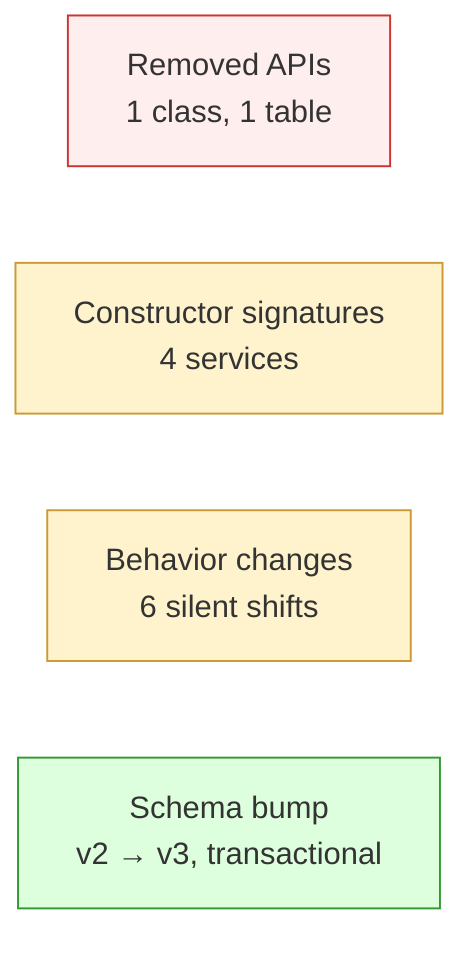

# Breaking changes — `frappe_mobile_sdk` 2.0

If you have a `1.x` app, this is the consolidated list of things that will fail to compile or behave differently after you bump to `2.0.0`. Each entry shows **before** (1.x) and **after** (2.0).

For the step-by-step upgrade flow, see [Migrating from 1.x](migrating-from-1.x.md).
For the full new-feature inventory, see [What's new](whats-new.md).

---

## Quick scan — change categories



| Category | Severity | Action required |
|---|---|---|
| Removed APIs | High | Replace call sites. |
| Constructor signature changes | Medium | Add new optional parameters or accept defaults. |
| Behavior changes (no API shape change) | Medium | Audit code that assumed old behavior. |
| Schema migration | Low | Automatic; no app changes needed. |

---

## 1. Removed APIs

### 1.1 `DocumentDao` — deleted

Removed entirely. All single-bag CRUD is now done by `OfflineRepository` + `UnifiedResolver`.

```dart
// 1.x
final dao = sdk.documentDao;
final docs = await dao.getAll(doctype: 'Customer');
final id = await dao.create(doctype: 'Customer', data: {...});
```

```dart
// 2.0
final result = await sdk.unifiedResolver.resolve(doctype: 'Customer');
final docs = result.rows;
final mobileUuid = await sdk.offlineRepository.saveDocument(
  doctype: 'Customer',
  data: {...},
);
```

`DocumentDao` is verified absent from `lib/src/` in `frappe_mobile_sdk` 2.0.

> **Method name change:** `createDocument` / `updateDocumentData` from 1.x are merged into a single `saveDocument({required String doctype, required Map<String, dynamic> data})` — it inserts when no `mobile_uuid` is present and updates when one is. `deleteDocument` now takes `(doctype:, mobileUuid:)` instead of `localId:`.

### 1.2 Legacy `documents` table — dropped

The single-bag JSON store is dropped during the v2 → v3 migration. Per-doctype `docs__<doctype>` tables are the new home for offline data.

You should not have been reading from `documents` directly through public APIs; `DocumentDao` was the only path. If you were, switch to the `OfflineRepository` calls above.

See [Schema migration](schema-migration.md) for the migration mechanics.

### 1.3 `DocumentEntity` — removed

`DocumentEntity` was the return type of every `DocumentDao` method in 1.x and was exported from the SDK barrel (`lib/frappe_mobile_sdk.dart`). It is gone in 2.0; per-doctype `docs__<doctype>` rows are now opaque `Map<String, Object?>` payloads keyed by `mobile_uuid`, returned from `UnifiedResolver` / `OfflineRepository` query helpers.

```dart
// 1.x — typed entity
List<DocumentEntity> docs = await sdk.documentDao.getAll(doctype: 'Customer');
final id = docs.first.localId;
final data = docs.first.dataJson; // Map<String, dynamic>
```

```dart
// 2.0 — Map-shaped rows
final result = await sdk.unifiedResolver.resolve(doctype: 'Customer');
final List<Map<String, Object?>> docs = result.rows;
final uuid = docs.first['mobile_uuid'] as String;
final customerName = docs.first['customer_name'] as String?;
```

If your code was annotated with `List<DocumentEntity>` or `DocumentEntity?` anywhere, replace those with `List<Map<String, Object?>>` / `Map<String, Object?>?`. The `localId` field maps to the `mobile_uuid` column; `dataJson` is no longer needed — fields are top-level on the row.

---

## 2. Constructor signature changes

If you build SDK services manually (rather than via `FrappeSDK.initialize()`), these constructors now take additional parameters. **All new parameters are optional with sensible defaults**, so call sites that don't reference them continue to compile.

> **`SyncController` is not user-constructable.** Its constructor takes internal types (`OutboxDao`, `RunPullFn`, `RunPullForFn`, `FetchSingleDocFn`, `ApplySingleDocFn`, `SyncStateNotifier`) that are intentionally not exported. Use `sdk.syncController` after `FrappeSDK.initialize()`. The construction recipe lives in `SyncEngineBuilder` (private).

### 2.1 `OfflineRepository`

```dart
// 1.x
OfflineRepository(database, client)
```

```dart
// 2.0 — `database` is positional; everything else is named.
OfflineRepository(
  database, {
  LocalWriter? localWriter,
  OfflineMode offlineMode = const OfflineMode(enabled: true, isPersisted: true),
  OfflineModeNotifier? offlineModeNotifier,
  FrappeClient? client,
  Future<DocTypeMeta> Function(String)? metaFetcher,
})
```

If you pass `offlineModeNotifier`, it wins over `offlineMode` — the repository reads live mode through the notifier so mid-session flips take effect at every gate site immediately. When the effective mode has `enabled = false`, `saveDocument` / `deleteDocument` route to `FrappeClient` directly.

### 2.2 `LinkOptionService`

```dart
// 1.x
LinkOptionService(client)
```

```dart
// 2.0
LinkOptionService(
  unifiedResolver,
  metaResolver, // MetaResolverFn — typically `(doctype) => metaService.get(doctype)`
)
```

This is the only constructor change with no backwards-compatible default — the resolver is now the canonical way to fetch link options.

### 2.3 `SyncService`

```dart
// 1.x
SyncService(client, offlineRepository, database, getMobileUuid)
```

```dart
// 2.0 — `client`, `offlineRepository`, `database` are positional;
//       `getMobileUuid` (and everything else) is named.
SyncService(
  client,
  offlineRepository,
  database, {
  Future<String?> Function()? getMobileUuid,
  OfflineMode offlineMode = const OfflineMode(enabled: true, isPersisted: true),
  OfflineModeNotifier? offlineModeNotifier,
  Future<void> Function()? pushRunner,
})
```

`pushRunner` is the production push driver — `FrappeSDK._doInitialize` wires it to `PushEngine.runOnce`. If you build `SyncService` manually without wiring `pushRunner`, `pushSync` returns `SyncResult.empty()` and logs a warning. As with `OfflineRepository`, `offlineModeNotifier` wins over `offlineMode` when both are passed. When the effective mode has `enabled = false`, every public method (`pushSync`, `pullSync`, `pullSyncMany`, `syncDoctype`, `getSyncStats`) returns `SyncResult.empty()` (or zeros) without touching the network or DB.

### 2.4 `UnifiedResolver`

This service is **new in 2.0** — no 1.x equivalent. All parameters are named:

```dart
UnifiedResolver({
  required Database db,                       // raw sqflite Database
  required DoctypeMetaDao metaDao,
  required IsOnlineFn isOnline,
  required BackgroundFetcher backgroundFetch, // (doctype, hint) → Future<void>
  required MetaResolverFn metaResolver,       // typically metaService.getMeta
  OfflineMode offlineMode = const OfflineMode(enabled: true, isPersisted: true),
  OfflineModeNotifier? offlineModeNotifier,
  FrappeClient? client,                       // required for online passthrough
})
```

Build it after `MetaService`, `OfflineRepository`, and `AuthService`; before `LinkOptionService`. As with `OfflineRepository` / `SyncService`, `offlineModeNotifier` wins over `offlineMode` when both are passed.

### 2.5 `FrappeSDK.forTesting`

`baseUrl` and `database` are **positional**; `offlineMode` is named with a default that exercises the offline path:

```dart
// 2.0
FrappeSDK.forTesting(
  'http://test',
  db, {
  OfflineMode offlineMode = const OfflineMode(enabled: true, isPersisted: true),
})
```

Existing tests continue to exercise the offline path (default). Tests that need to verify the online-only branch must opt in:

```dart
final sdk = FrappeSDK.forTesting(
  'http://test',
  db,
  offlineMode: const OfflineMode(enabled: false, isPersisted: true),
);
```

---

## 3. Behavior changes (no API shape change)

These are subtle: your call sites still compile, but the runtime behavior shifted. Audit any code that assumed the old behavior.

### 3.1 List reads route through `UnifiedResolver`

Any public read API that produced a list — `LinkOptionService.getLinkOptions`, list-screen queries, `fetch_from` resolution — now goes through `UnifiedResolver`. In offline mode it queries `docs__<doctype>` first, returns `QueryResult` with `RowOrigin` per row, and decorates Link values via `LinkDecorator`.

If you were inspecting raw JSON shapes from old read paths, switch to `QueryResult.rows` (typed map per row).

### 3.2 `pullSync` skips child doctypes

```dart
// 1.x: would attempt frappe.client.get_list on a child doctype, fail with PermissionError.
final result = await sdk.syncService.pullSync('Sales Invoice Item');
```

```dart
// 2.0: returns SyncResult.empty() immediately. No HTTP call.
final result = await sdk.syncService.pullSync('Sales Invoice Item'); // 0 rows, no error
```

The guard is `lib/src/services/sync_service.dart::SyncService._isChildTable`, invoked at the top of `_pullOneInternal`. Children come embedded in their parent's pull (`DoctypeService.bulkGetWithChildren`).

### 3.3 Push is tier-ordered, not FIFO

In 1.x, the outbox drained in insertion order. In 2.0, `lib/src/sync/tier_computer.dart::TierComputer.compute` groups rows by inter-pending dependencies. Tier 0 rows have no upstream dependencies; tier `k` depends only on tiers `< k`. Within a tier, order is `createdAt asc, id asc`.

If your tests asserted strict insertion-order push behavior, they will fail. Assert tier ordering instead, or assert eventual consistency.

### 3.4 Form-level cascade clears (silent)

When a Link field's value changes, the form auto-clears any sibling Link field whose `linkFilters` contain `eval:doc.{this_field}`. This is form-builder behavior inside `lib/src/ui/widgets/form_builder.dart::_FrappeFormBuilderState`'s per-field `onChanged`: when `oldValue != value`, it walks `widget.meta.fields` and removes any `Link` field whose `linkFilters` regex matches `eval\s*:\s*doc.{thisFieldname}`.

**Implication for `FieldChangeHandler` callbacks**: stop manually clearing dependent Link fields. The SDK already does it. Keep the handler limited to value-derivation:

```dart
// 1.x style — manually clear dependents
Map<String, dynamic>? onFieldChange(name, value, formData) {
  if (name == 'customer') {
    return {'customer_address': null}; // stop doing this
  }
  return null;
}
```

```dart
// 2.0 style — value derivation only; SDK handles clears
Map<String, dynamic>? onFieldChange(name, value, formData) {
  if (name == 'qty' || name == 'rate') {
    return {'amount': (formData['qty'] ?? 0) * (formData['rate'] ?? 0)};
  }
  return null;
}
```

### 3.5 UUID-shaped Link values resolve locally only

Any string matching the v4 UUID shape (`8-4-4-4-12 hex`) is treated as a local mobile_uuid. The SDK never calls `getByName` for it — server names never match the UUID pattern. Predicate: `lib/src/utils/uuid_pattern.dart::looksLikeMobileUuid`. Primary consumer: `lib/src/ui/form_screen.dart` (the `getByName` short-circuit in the link-display resolution path).

If your app passes server names in UUID-like formats (it shouldn't, but Frappe's autoname is flexible), they will be misclassified. Use server-side `autoname=field:mobile_uuid` to align identities.

### 3.6 Three-key child match on pull-apply

When a parent doc is pulled, its children are matched by `server_name → mobile_uuid → position` inside `lib/src/sync/pull_apply.dart::PullApply.applyPageInTxn` (the child-reconciliation loop following the parent insert/update). This preserves child UUIDs across re-pulls and avoids orphaning Link references.

If you had custom logic that assumed children are always blown away and re-inserted on each pull, it still happens — but with identity preservation. Inbound Link references that point at a child by `mobile_uuid` continue to resolve after pull.

---

## 4. Schema migration

Automatic, transactional, one-shot. Not a breaking change for your **app code**, but it is a breaking change for the **on-disk database** — there is no downgrade path.

| Before (v2) | After (v3) |
|---|---|
| `documents` (legacy single-bag) | Dropped. |
| (no per-doctype tables) | `docs__<doctype>` lazily created on first pull. |
| (no system tables) | `outbox`, `pending_attachments`, `sdk_meta`. |
| `doctype_meta` | Same table, with v3 + v4 column extensions added safely via `ALTER TABLE ADD COLUMN`. |

See [Schema migration](schema-migration.md) for the full v2→v3 walkthrough with diagrams.

**Downgrade is unsupported** — `sqflite` has no downgrade hook, and the SDK does not retain a v3→v2 reverse migration.

---

## 5. What did NOT change (compat reassurance)

To make the upgrade calculus easier, here's what stays the same:

- `FrappeClient` API — auth, doctype, document, attachment services; OAuth helper; query builder. Same surface as 1.x.
- All form widget classes — `FrappeFormBuilder`, `FormScreen`, every `*Field` widget, `DefaultFormStyle`.
- Login screens, `FrappeAppGuard`, `LoginScreen`, `DoctypeListScreen`, `DocumentListScreen`.
- Translations API — `TranslationService` keeps the same surface.
- `WorkflowService` and `WorkflowTransition`.
- `FrappeException` hierarchy (`AuthException`, `ApiException`, `NetworkException`, `ValidationException`).

If your app uses only those surfaces, the upgrade is a `pubspec` bump plus a server-flag flip.

---

## See also

- [Migrating from 1.x](migrating-from-1.x.md) — checklist + step-by-step.
- [Schema migration](schema-migration.md) — what happens on the next launch.
- [What's new](whats-new.md) — what you gain in exchange.
