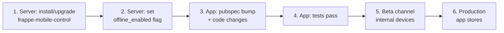
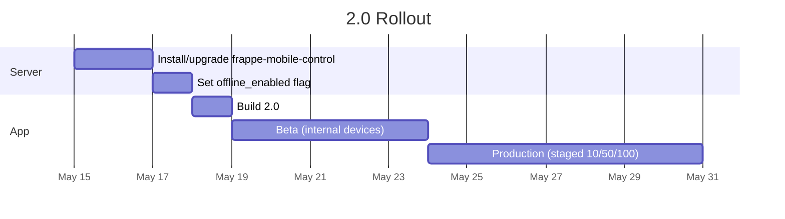

# Migrating from 1.x to 2.0

This is the operator-facing checklist for upgrading an existing app on `frappe_mobile_sdk` 1.x to 2.0.0.

| Step | Why it matters |
|---|---|
| [1. Server prerequisites](#1-server-prerequisites) | The `offline_enabled` flag must exist server-side before the SDK reads it. |
| [2. Decide your offline-mode rollout](#2-decide-your-offline-mode-rollout) | Determines whether existing offline users keep their local data. |
| [3. Bump the dependency](#3-bump-the-dependency) | `pubspec.yaml`, `pubspec.lock`. |
| [4. Update SDK call sites](#4-update-sdk-call-sites) | Constructor changes; removed `DocumentDao`. |
| [5. Update form callbacks](#5-update-form-callbacks) | Stop manually clearing dependents. |
| [6. Update tests](#6-update-tests) | `forTesting` defaults change; in-memory DB. |
| [7. Wire the new sync UI](#7-wire-the-new-sync-ui-optional-but-recommended) | `OfflineTransitionGuard`, `SyncStatusBar`. |
| [8. Smoke test the migration](#8-smoke-test-the-migration) | Fresh install + upgrade-from-1.x paths. |
| [9. Roll out](#9-roll-out) | Order of operations across server, beta, prod. |

For diagrams and reference, see [Architecture](architecture.md), [Breaking changes](breaking-changes.md), [Schema migration](schema-migration.md).

---

## Recommended rollout order



**Server first, app second.** A device that bumps the SDK before the server has the `offline_enabled` field will see the column default (`false`) and may drain + wipe local data on the next launch.

---

## 1. Server prerequisites

The companion server app `frappe-mobile-control` must be at version 1.x or later, which:

- Adds the `offline_enabled` Check field to the `Mobile Configuration` doctype (with `depends_on: eval:doc.enabled`).
- Surfaces the field on every authenticated login response.

```bash
cd /path/to/frappe-bench

# If not yet installed:
bench get-app https://github.com/dhwani-ris/frappe-mobile-control
bench install-app frappe-mobile-control

# If already installed, upgrade:
bench update --apps frappe-mobile-control

bench migrate
```

Then, in the Frappe Desk:

1. Open `Mobile Configuration` (single doctype, one row per site).
2. Tick `Enabled` if it isn't already.
3. Decide on `Offline Enabled`:
   - **Tick if** you want this deployment to run as offline-first.
   - **Untick if** you want the SDK to operate as a thin online client.
4. Save.

The flag is read by every device on its next login.

---

## 2. Decide your offline-mode rollout

Pick the matrix row that matches your situation:

| Your 1.x deployment | `offline_enabled` choice for 2.0 | What happens on first 2.0 launch |
|---|---|---|
| Online-only (1.x didn't write to `documents`) | `false` (default) | SDK boots online. Schema migration runs (v2 → v3). No local data, no transition. |
| Offline-first (1.x wrote to `documents`) | `true` | Schema migration runs; legacy `documents` is dropped (it's a write-through cache by 1.1.0, no data loss). SDK boots offline. Per-doctype tables created lazily on first pull. |
| Offline-first, but migrating to online-only | `false` | Schema migration runs; legacy `documents` dropped. On first login the server returns `offline_enabled = false`; if the device had local residue, `OfflineTransitionService` runs `runDrainAndWipe()` — drains pending records to the server, then drops the per-doctype + outbox + attachment tables. |

The "offline-first, migrating to online-only" row is the only flow with **user-visible behavior** during transition — see [Architecture §8 — Offline-mode lifecycle](architecture.md#8-offline-mode-lifecycle) and [`doc/OFFLINE_MODE_TOGGLE.md`](../OFFLINE_MODE_TOGGLE.md).

---

## 3. Bump the dependency

In your app's `pubspec.yaml`:

```yaml
dependencies:
  frappe_mobile_sdk: ^2.0.0
```

Then:

```bash
flutter pub upgrade frappe_mobile_sdk
flutter pub get
```

If you pin to a git ref instead of pub.dev, update the `ref:` to the `v2.0.0` tag (or the appropriate branch).

---

## 4. Update SDK call sites

Run a search for `DocumentDao` — there should be **zero hits** after the upgrade:

```bash
grep -rn "DocumentDao" lib/ test/
```

For each hit, replace per the table below:

| 1.x usage | 2.0 replacement |
|---|---|
| `sdk.documentDao.getAll(doctype: 'X')` | `(await sdk.unifiedResolver.resolve(doctype: 'X')).rows` |
| `sdk.documentDao.create(doctype, data)` | `sdk.offlineRepository.createDocument(doctype: 'X', data: data)` |
| `sdk.documentDao.update(localId, data)` | `sdk.offlineRepository.updateDocumentData(localId: ..., data: ...)` |
| `sdk.documentDao.delete(localId)` | `sdk.offlineRepository.deleteDocument(localId: ...)` |
| `sdk.documentDao.getById(localId)` | `sdk.offlineRepository.getRowFromPerDoctypeTable(...)` |

If you build SDK services manually (rare), update constructor signatures per [Breaking changes §2](breaking-changes.md#2-constructor-signature-changes).

---

## 5. Update form callbacks

If your `FieldChangeHandler` callbacks manually cleared dependent Link fields when a parent Link changed, **delete that code**. The form-builder now auto-clears any sibling Link field whose `linkFilters` contain `eval:doc.{this_field}`. See [Breaking changes §3.4](breaking-changes.md#34-form-level-cascade-clears-silent).

```dart
// 1.x — DELETE this kind of manual clear
Map<String, dynamic>? onFieldChange(name, value, formData) {
  if (name == 'customer') {
    return {'customer_address': null, 'shipping_address': null};
  }
  return null;
}
```

```dart
// 2.0 — keep value-derivation only
Map<String, dynamic>? onFieldChange(name, value, formData) {
  if (name == 'qty' || name == 'rate') {
    return {'amount': (formData['qty'] ?? 0) * (formData['rate'] ?? 0)};
  }
  return null;
}
```

If you use `LinkFilterBuilder` (new in 2.0), make sure builders are keyed on the **target doctype**, not the owning doctype. See [What's new §9](whats-new.md#9-linkfilterbuilder-hook).

---

## 6. Update tests

`FrappeSDK.forTesting` now accepts an `offlineMode` parameter that defaults to **enabled**. Most existing tests will keep working unchanged because they exercise the offline path. Tests that need to verify online-only behavior must opt in:

```dart
// Online-only test — baseUrl + database are positional.
final sdk = FrappeSDK.forTesting(
  'http://test',
  db,
  offlineMode: const OfflineMode(enabled: false, isPersisted: true),
);
```

Other test impacts:

- Tests that asserted **strict insertion-order push behavior** will fail under 2.0's tier-ordered push. Switch to asserting tier ordering, or assert eventual consistency (all rows synced).
- Tests that called `pullSync` on a child doctype expecting an HTTP call will see `SyncResult.empty()` returned without a network call. Update the assertion accordingly.

If you have an integration test that exercises the migration itself, model it on `test/database/app_database_fresh_vs_upgraded_test.dart` (referenced from the `AppDatabase._onCreate` docstring).

---

## 7. Wire the new sync UI (optional but recommended)

The 2.0 sync UI surface is opt-in but reduces a lot of bespoke wiring. Minimum-viable integration:

```dart
class App extends StatelessWidget {
  final FrappeSDK sdk;
  const App({super.key, required this.sdk});

  @override
  Widget build(BuildContext context) {
    return MaterialApp(
      builder: (context, child) {
        // Offline → online transition takes over the screen when active.
        return OfflineTransitionGuard(
          service: sdk.offlineTransition,
          child: Column(children: [
            // Persistent status strip at the top.
            SyncStatusBar(notifier: sdk.syncStateNotifier),
            Expanded(child: child ?? const SizedBox.shrink()),
          ]),
        );
      },
      home: HomeScreen(sdk: sdk),
    );
  }
}
```

Optional add-ons:

- **Initial bootstrap pull** — push `SyncProgressScreen` when `getPullPhases` returns any `initial` or `resume` doctype.
- **Sync errors** — link `SyncErrorsScreen` from a settings menu or the status bar tap target.
- **Logout safety** — wrap your logout button with `showLogoutGuardDialog` (soft) and `showForceLogoutConfirm` (hard) when there are unsynced rows.

Full inventory in [What's new §7](whats-new.md#7-new-sync-ui-surface).

---

## 8. Smoke test the migration

Two scenarios:

### 8.1 Fresh install (no prior 1.x data)

```bash
flutter run
```

Expected:

- App launches without errors.
- `sdk_meta.schema_version == 3`.
- `documents` table does not exist.
- After login + first pull, `docs__<doctype>` tables exist for each pulled doctype.

### 8.2 Upgrade from 1.x

To simulate, restore a 1.x database file (schema v2) onto a test device, then install the 2.0 build:

```bash
# On a test device (or emulator) with adb
adb push 1x_database.db /data/data/<your_app>/databases/app.db

# Install 2.0 build
flutter install --device-id=<id>
flutter run --device-id=<id>
```

Expected:

- `_onUpgrade` runs on first DB open.
- Single transactional migration completes.
- `documents` table is dropped.
- `sdk_meta.schema_version == 3`.
- Existing `doctype_meta` rows preserved (with new columns added).
- App launches normally.

If the migration fails, the transaction rolls back and `_onUpgrade` runs again on the next launch. Step-level idempotency means the retry is safe — see [Schema migration §6](schema-migration.md#6-re-entrancy-and-crash-recovery).

---

## 9. Roll out



Recommended cadence:

1. **Server upgrade** — non-breaking; `frappe-mobile-control` 1.x adds a field, doesn't remove anything.
2. **Set the flag** — flip `Mobile Configuration.offline_enabled` to your target value.
3. **Beta** — 2.0 build to internal devices for at least a few days. Watch for migration failures (rare) and offline-transition issues (more common if the matrix row from §2 is the third one).
4. **Staged production** — 10% → 50% → 100% over 1–2 weeks. Pause on any spike in `SyncErrors`.

If you hit issues, you cannot downgrade the SDK on a device. The recovery path is "fix forward" — patch release.

---

## See also

- [What's new](whats-new.md) — what you gain.
- [Breaking changes](breaking-changes.md) — full diff.
- [Schema migration](schema-migration.md) — what runs on the next launch.
- [Architecture](architecture.md) — how it all fits together.
- [Limitations](limitations.md) — known gotchas.
- [`doc/OFFLINE_MODE_TOGGLE.md`](../OFFLINE_MODE_TOGGLE.md) — server-flag deep dive.
- [`doc/OFFLINE_FIRST.md`](../OFFLINE_FIRST.md) — offline subsystem deep dive.
