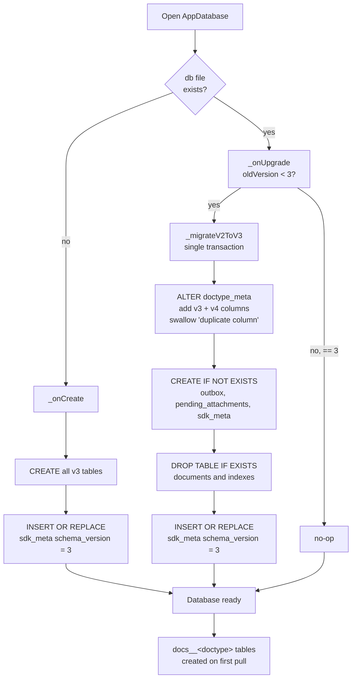
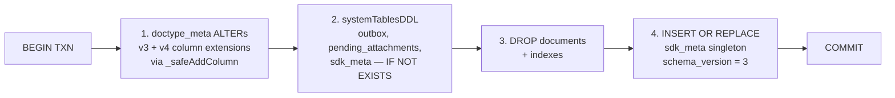
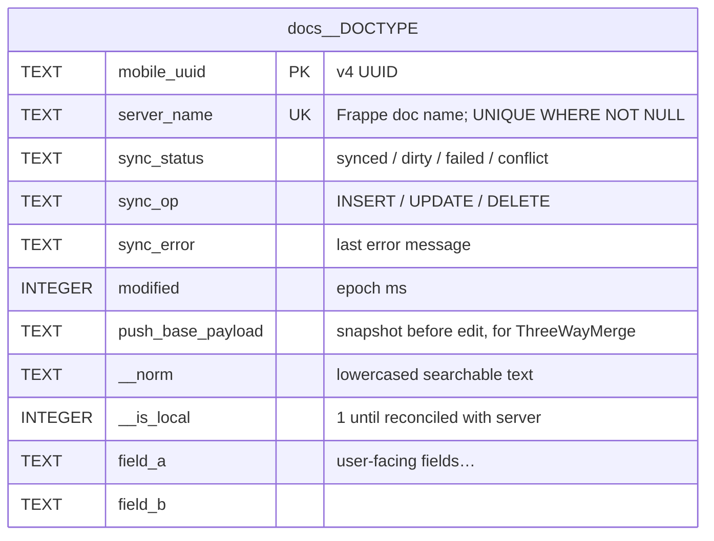
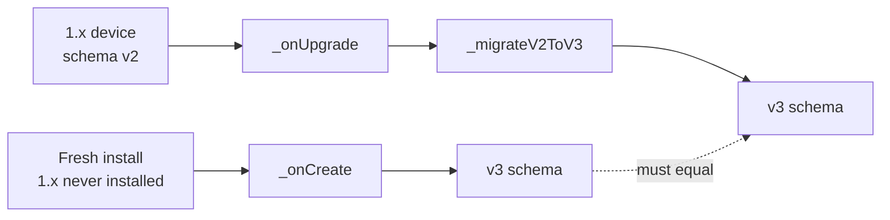

# Schema migration — v2 → v3

When a device running `frappe_mobile_sdk` 1.x (database schema v2) opens the database after upgrading to 2.0.0, a single transactional migration runs and brings the schema to v3.

The migration is **automatic, idempotent, atomic, and one-shot**. There is **no downgrade path**.

---

## 1. The version constants

| Constant | Value | Source |
|---|---|---|
| `pubspec.yaml: version` | `2.0.0` | SDK package version |
| `AppDatabase._version` | `3` | `lib/src/database/app_database.dart::AppDatabase._version` |
| `sdk_meta.schema_version` row | `3` | written by both `lib/src/database/app_database.dart::AppDatabase._onCreate` and `lib/src/database/app_database.dart::AppDatabase._migrateV2ToV3` |

The `_version` constant and the `sdk_meta.schema_version` row are kept in lockstep by both code paths. Any future schema bump must update both together.

---

## 2. Fresh-install vs upgrade

Two paths arrive at the same end state:



- Fresh-install builder: `lib/src/database/app_database.dart::AppDatabase._onCreate`.
- Upgrade dispatcher: `lib/src/database/app_database.dart::AppDatabase._onUpgrade`.
- Migration body: `lib/src/database/app_database.dart::AppDatabase._migrateV2ToV3`.
- `test/database/app_database_fresh_vs_upgraded_test.dart` (referenced from the `_onCreate` docstring) verifies that fresh-install and upgraded databases have identical schema.

---

## 3. The migration steps

`_migrateV2ToV3` runs all four steps inside a single `db.transaction(...)`.



### Step 1 — `doctype_meta` extensions

The pre-existing `doctype_meta` table from v2 needs additional columns for v3. Each `ALTER TABLE ADD COLUMN` statement is wrapped by `lib/src/database/app_database.dart::AppDatabase._safeAddColumn`, which catches and ignores `"duplicate column name"` errors so the migration is **idempotent**.

```dart
for (final stmt in [
  ...doctypeMetaExtensionsDDL(),
  ...doctypeMetaV4ExtensionsDDL(),
]) {
  await _safeAddColumn(txn, stmt);
}
```

This pattern matters: `ALTER TABLE` is the only non-idempotent SQL in the migration. Everything else uses `IF NOT EXISTS` or `INSERT OR REPLACE`.

### Step 2 — system tables

```dart
for (final stmt in systemTablesDDL()) {
  await txn.execute(stmt);
}
```

Creates `outbox`, `pending_attachments`, `sdk_meta` if they don't exist. Each statement uses `CREATE TABLE IF NOT EXISTS` so re-running is safe.

### Step 3 — drop legacy `documents`

```sql
DROP TABLE IF EXISTS documents;
DROP INDEX IF EXISTS idx_documents_doctype_status;
DROP INDEX IF EXISTS idx_documents_modified;
```

This is safe because `1.x` (v1.1.0 specifically) **pushes before persisting** — there are no in-flight unsynced rows in `documents` at upgrade time. The `documents` table is effectively a write-through cache by v1.1.0; dropping it loses no data.

### Step 4 — singleton row

```dart
await txn.insert('sdk_meta', {
  'id': 1,
  'schema_version': 3,
}, conflictAlgorithm: ConflictAlgorithm.replace);
```

`INSERT OR REPLACE` (via `ConflictAlgorithm.replace`) recovers from a missing or corrupted singleton row. After this, `sdk_meta.schema_version == 3` is guaranteed.

The full migration is **idempotent** — re-running it on a v3 database is a no-op (`ALTER` swallows duplicates, `CREATE IF NOT EXISTS` is no-op, `DROP IF EXISTS` is no-op, `INSERT OR REPLACE` re-stamps the same value).

---

## 4. Storage layers after migration

### 4.1 Per-doctype mirror (lazy)

Tables of the form `docs__<doctype>` and `docs__<child_doctype>`. Created **on first pull** for that doctype, via `lib/src/services/offline_repository.dart::OfflineRepository.ensureSchemaForClosure`.

Parent-doctype schema (`lib/src/database/schema/parent_schema.dart`):



Child-doctype schema adds:

```
parent_uuid TEXT REFERENCES docs__<parent_doctype>(mobile_uuid)
idx INTEGER  -- 0-based locally; Frappe re-numbers to 1-based on save
parentfield TEXT
parenttype TEXT
```

### 4.2 System tables (eager)

Created on every fresh install or migration:

| Table | Shape | Purpose |
|---|---|---|
| `sdk_meta` | singleton row (`id INTEGER PRIMARY KEY CHECK (id = 1)`) | tracks `schema_version`, bootstrap state, offline mode, session user JSON. |
| `outbox` | `id, doctype, mobile_uuid, operation, state, retry_count, created_at, ...` | push queue indexed by `(state, created_at)`. |
| `pending_attachments` | `id, doctype, mobile_uuid, file_path, state, retry_count, ...` | file-upload queue with retry semantics. |

DDL: `lib/src/database/schema/system_tables.dart`.

### 4.3 Other system tables

Pre-existing from v2, retained:

- `doctype_meta` — DocType metadata cache, with v3 + v4 extension columns added.
- `auth_tokens` — encrypted tokens for session restore.
- `doctype_permission` — per-doctype permission cache.

### 4.4 Legacy

| Table | Status |
|---|---|
| `documents` | **Dropped.** No replacement (use `docs__<doctype>` per-doctype tables). |

---

## 5. Verification: fresh-install ≡ upgraded

The two paths must produce **byte-identical schema**:



This invariant is checked by `test/database/app_database_fresh_vs_upgraded_test.dart` (referenced from the `AppDatabase._onCreate` docstring). Run it whenever the schema changes — diverging the two paths is a recipe for "works on new installs, breaks on upgrades."

---

## 6. Re-entrancy and crash recovery

`sqflite` runs `_onUpgrade` **once** per `openDatabase` call, before any user-issued SQL. If the migration crashes mid-step, the entire transaction rolls back; on the next launch, `sqflite` invokes `_onUpgrade` again with `oldVersion = 2`.

Each step is idempotent (Step 1 swallows duplicate-column errors, Steps 2/3 are `IF [NOT] EXISTS`, Step 4 is `INSERT OR REPLACE`), so the retry is safe.

Crash matrix:

| Crash point | On retry |
|---|---|
| Mid-`ALTER` | Already-added columns are skipped; remaining columns added. |
| Mid-`CREATE` | Already-created tables skipped; remaining created. |
| Mid-`DROP documents` | Already dropped — `IF EXISTS` is no-op. |
| Mid-`INSERT OR REPLACE` | Re-stamps the same singleton row. |
| Mid-transaction (any step) | Whole transaction rolls back; on next launch the database is still at v2; `_onUpgrade` runs again. |

---

## 7. Limitations and gotchas

- **No downgrade.** `sqflite` does not provide an `_onDowngrade` hook in this SDK's setup. Users cannot downgrade through the app stores.
- **No telemetry.** The migration does not emit metrics; failures surface as exceptions on the next `openDatabase` call. If you need rollout visibility, add it at the app level around `FrappeSDK.initialize()`.
- **Post-migration online-only by default.** The schema bump is **decoupled** from the offline-mode flag. A device that was offline in 1.x will see `sdk_meta.offline_enabled = false` (the column default) on first launch unless the server flag has already been flipped or the device's previous mode was `true` and the SDK persisted that. Coordinate with the server-side `frappe-mobile-control` upgrade — see [migrating-from-1.x.md → Server prerequisites](migrating-from-1.x.md#1-server-prerequisites).

---

## See also

- [Architecture §3 — Storage layers](architecture.md#3-storage-layers)
- [Migrating from 1.x](migrating-from-1.x.md) — full upgrade checklist.
- [Limitations](limitations.md) — known migration gotchas.
